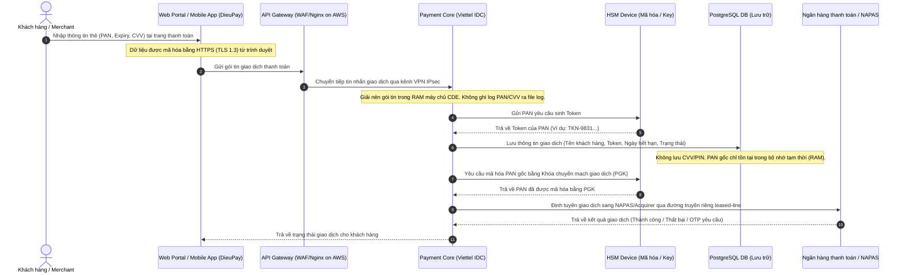
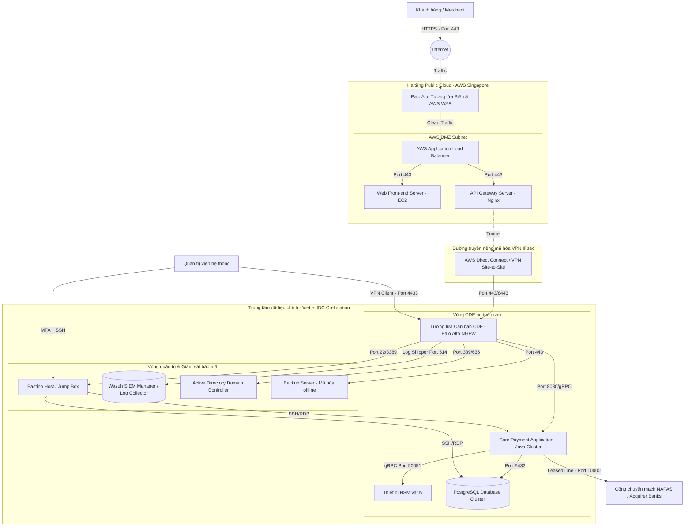

# BÁO CÁO ĐÁNH GIÁ KHOẢNG CÁCH TUÂN THỦ PCI DSS V4.0 (GAP ASSESSMENT REPORT)
**Dự án: Đánh giá và Xây dựng Lộ trình Tuân thủ Tiêu chuẩn PCI DSS v4.0**  
**Khách hàng: Công ty Cổ phần Công nghệ Thanh toán Việt Nam (DieuPay)**  
**Đơn vị tư vấn: Antigravity Cyber Security Consulting**  
**Phiên bản: 1.0 (Bản thảo chính thức)**  
**Ngày lập báo cáo: 10 tháng 06 năm 2026**

---

## 1. Executive Summary (Tóm tắt Dự án)

### 1.1. Giới thiệu dự án
Dự án đánh giá khoảng cách bảo mật theo tiêu chuẩn PCI DSS v4.0 (Payment Card Industry Data Security Standard) được thực hiện bởi Antigravity Cyber Security Consulting dành cho Công ty Cổ phần Công nghệ Thanh toán Việt Nam (DieuPay). DieuPay là đơn vị trung gian thanh toán đang trên đà phát triển nhanh chóng tại thị trường Việt Nam, cung cấp dịch vụ cổng thanh toán (Payment Gateway) và ví điện tử (E-wallet). 

Để mở rộng dịch vụ, hợp tác sâu rộng với các tổ chức thẻ quốc tế (Visa, Mastercard, JCB, American Express) và các ngân hàng thành viên NAPAS, DieuPay đặt mục tiêu đạt chứng nhận tuân thủ PCI DSS v4.0 Level 1 (dành cho các đơn vị xử lý trên 6 triệu giao dịch thẻ/năm). Dự án Gap Assessment này là bước đi chiến lược đầu tiên nhằm xác định vị thế an toàn thông tin hiện tại của DieuPay, định vị các điểm yếu bảo mật, và thiết lập một kế hoạch khắc phục (Remediation Plan) khả thi để chuẩn bị cho kỳ đánh giá chính thức (QSA Audit).

### 1.2. Mục tiêu Gap Assessment
*   **Xác định chính xác Phạm vi đánh giá (Scope)**: Khoanh vùng tất cả các hệ thống, nhân sự, quy trình có lưu trữ, xử lý hoặc truyền tải dữ liệu thẻ thanh toán (Cardholder Data - CHD) hoặc dữ liệu xác thực nhạy cảm (Sensitive Authentication Data - SAD).
*   **Phân tích và Đối chiếu (Gap Analysis)**: Đánh giá hiện trạng hạ tầng công nghệ thông tin (CNTT), kiến trúc mạng, các chính sách, quy trình vận hành của DieuPay so với 12 yêu cầu kỹ thuật và quản lý của tiêu chuẩn PCI DSS v4.0.
*   **Nhận diện Rủi ro (Risk Identification)**: Đưa ra các đánh giá về mức độ rủi ro đối với các lỗ hổng bảo mật hoặc khoảng cách tuân thủ đang tồn tại.
*   **Đề xuất Kế hoạch Khắc phục (Remediation & Roadmap)**: Cung cấp giải pháp kỹ thuật, quy trình quản trị, ước tính nguồn lực và lộ trình thực hiện cụ thể để DieuPay đóng các khoảng cách (Gaps) trước khi tiến hành đánh giá cấp chứng nhận chính thức.

### 1.3. Phạm vi đánh giá
Phạm vi đánh giá bao trùm toàn bộ môi trường dữ liệu chủ thẻ (Cardholder Data Environment - CDE) của DieuPay, bao gồm:
*   Hệ thống Cổng thanh toán (Payment Gateway Core) xử lý giao dịch thẻ trực tuyến tích hợp qua API và SDK.
*   Hệ thống ứng dụng Ví điện tử DieuPay (phiên bản Mobile App trên iOS/Android và Backend API).
*   Toàn bộ máy chủ vật lý đặt tại Trung tâm Dữ liệu Viettel IDC (Co-location) và các tài nguyên ảo hóa trên Amazon Web Services (AWS) đóng vai trò là điểm tiếp nhận/định tuyến giao dịch.
*   Các phòng ban liên quan: Khối Công nghệ thông tin (IT Operations), Khối Phát triển sản phẩm (R&D/Dev), Khối Bảo mật & Tuân thủ (Security & Compliance), Bộ phận Chăm sóc khách hàng (Customer Service - CS) và các bên thứ ba cung cấp dịch vụ hạ tầng mạng/hosting.

### 1.4. Phương pháp đánh giá
Chúng tôi áp dụng phương pháp đánh giá kết hợp ba trụ cột tiêu chuẩn của đánh giá an ninh thông tin:

```
┌─────────────────────────────────────────────────────────────────┐
│                    PHƯƠNG PHÁP ĐÁNH GIÁ (METHODOLOGY)           │
├─────────────────┬──────────────────────────────┬────────────────┤
│ Phỏng vấn (QA)  │ Xem xét tài liệu (Review)   │ Kiểm tra kỹ thuật│
│ Phỏng vấn nhân  │ Rà soát chính sách, quy      │ Đánh giá cấu   │
│ sự quản trị,    │ trình vận hành (SOP),        │ hình hệ thống, │
│ vận hành, dev,  │ hồ sơ thiết kế mạng, báo     │ luật firewall, │
│ bảo mật.        │ cáo quét lỗ hổng bảo mật.    │ cơ chế mã hóa. │
└─────────────────┴──────────────────────────────┴────────────────┘
```

*   **Phỏng vấn nhân sự (Interviews)**: Thực hiện phỏng vấn sâu với các Quản lý hệ thống, Kỹ sư mạng, Kỹ sư bảo mật, Chuyên viên phát triển phần mềm, Kỹ sư DevOps, Trưởng nhóm Chăm sóc khách hàng và Đại diện Ban giám đốc của DieuPay để hiểu rõ thực tế vận hành.
*   **Đánh giá Tài liệu (Document Review)**: Kiểm tra các chính sách an toàn thông tin (ATTT), quy trình vận hành tiêu chuẩn (SOP), tài liệu kiến trúc mạng, tài liệu thiết kế luồng dữ liệu, hợp đồng dịch vụ với các bên thứ ba (SLA/NDA), kết quả đánh giá lỗ hổng định kỳ và biên bản ứng phó sự cố.
*   **Kiểm tra Kỹ thuật (Technical Audit & Configuration Review)**: Xem xét cấu hình của thiết bị mạng (Firewall, Switch, Router), quy tắc tường lửa (ACL), cấu hình hệ điều hành (Windows/Linux), cấu hình cơ sở dữ liệu (Database Server), cơ chế mã hóa dữ liệu truyền tải (TLS 1.2/1.3), thuật toán mã hóa dữ liệu lưu trữ (AES-256) và cơ chế phân quyền truy cập thông qua Active Directory/IAM.

### 1.5. Kết quả tổng quan
Qua quá trình đánh giá kéo dài 3 tuần từ ngày 18/05/2026 đến ngày 08/06/2026, Antigravity ghi nhận trạng thái tuân thủ tổng quan của DieuPay như sau:
*   **Tổng số yêu cầu con đánh giá**: 252 kiểm soát (dựa trên 12 yêu cầu chính của PCI DSS v4.0).
*   **Đã Tuân thủ (Compliant)**: **78 / 252** kiểm soát (chiếm khoảng 31%). Các kiểm soát đạt phần lớn nằm ở việc bảo vệ vật lý tại Viettel IDC và một số chính sách ATTT cơ bản được kế thừa từ các tiêu chuẩn khác.
*   **Chưa Tuân thủ (Non-Compliant/Gap)**: **144 / 252** kiểm soát (chiếm khoảng 57%). Các lỗ hổng nghiêm trọng nằm ở việc thiếu phân tách mạng triệt để, rò rỉ dữ liệu thẻ dạng rõ (clear text) tại log hệ thống, chưa mã hóa khóa quản trị đúng tiêu chuẩn, thiếu xác thực đa yếu tố (MFA) cho quyền truy cập nội bộ, và quy trình giám sát log tập trung chưa hoạt động hiệu quả.
*   **Không Áp dụng (Not Applicable)**: **30 / 252** kiểm soát (chiếm khoảng 12%), chủ yếu liên quan đến các thiết bị thanh toán vật lý POS (do DieuPay chỉ tập trung vào thanh toán trực tuyến - Card-Not-Present) và một số tính năng quản lý thẻ chip đặc thù.

---

## 2. Company Overview (Tổng quan Doanh nghiệp)

### 2.1. Giới thiệu doanh nghiệp
*   **Tên công ty**: Công ty Cổ phần Công nghệ Thanh toán Việt Nam (DieuPay)
*   **Tên giao dịch quốc tế**: DieuPay Payment Technology Joint Stock Company
*   **Lĩnh vực hoạt động**: Trung gian thanh toán, Cung cấp cổng thanh toán trực tuyến (Payment Gateway) cho các doanh nghiệp thương mại điện tử, dịch vụ Ví điện tử cá nhân (E-wallet) hỗ trợ liên kết thẻ ngân hàng nội địa và quốc tế, và cung cấp giải pháp thu hộ - chi hộ tự động.
*   **Quy mô hoạt động**: 
    *   **Số lượng giao dịch**: Trung bình đạt 450,000 giao dịch/ngày, cao điểm có thể lên tới 800,000 giao dịch/ngày. Tổng số lượng giao dịch thẻ quốc tế xử lý trong năm gần nhất là 7.2 triệu giao dịch (Xếp hạng đơn vị cung cấp dịch vụ PCI DSS Level 1).
    *   **Đối tác**: Hơn 5,000 đối tác tích hợp (Merchants) từ các cửa hàng nhỏ lẻ đến các chuỗi bán lẻ, trang thương mại điện tử lớn tại Việt Nam.
*   **Cơ cấu nhân sự**: 250 nhân sự chính thức, trong đó cơ cấu phòng ban liên quan trực tiếp đến hệ thống công nghệ và an toàn thông tin bao gồm:
    *   **Khối Công nghệ & Hạ tầng (IT & Infrastructure)**: 35 nhân sự (Quản trị hệ thống, mạng, DB, Cloud, DevOps).
    *   **Khối Phát triển Sản phẩm (R&D/Engineering)**: 85 nhân sự (Software Developers, QA/QC, Product Owners).
    *   **Trung tâm An toàn thông tin (Security Center - SOC)**: 12 nhân sự phụ trách giám sát bảo mật, điều tra sự cố, tuân thủ và quản lý định danh.
    *   **Khối Vận hành Kinh doanh & Đối soát (Operations & Reconciliation)**: 40 nhân sự phụ trách làm việc với ngân hàng, merchants và giải quyết khiếu nại.
    *   **Khối Dịch vụ Khách hàng (Customer Support)**: 50 nhân sự trực tổng đài và xử lý yêu cầu người dùng cuối.

### 2.2. Mô hình kinh doanh
Mô hình hoạt động của DieuPay chia làm hai mảng chính:
1.  **Dịch vụ Cổng thanh toán (B2B)**: DieuPay cung cấp API/SDK thanh toán cho các Merchant. Khách mua hàng tại web/app của Merchant chọn thanh toán bằng thẻ (Visa/Mastercard/JCB/Napas). Thông tin thẻ được điền trên giao diện tích hợp (Widget/Hosted Fields của DieuPay hoặc gọi trực tiếp API của DieuPay). DieuPay tiếp nhận thông tin thẻ, mã hóa, định tuyến giao dịch tới Tổ chức chuyển mạch thẻ (NAPAS) hoặc trực tiếp tới Ngân hàng thanh toán (Acquirer) để thực hiện giao dịch thanh toán và nhận phản hồi trạng thái.
2.  **Dịch vụ Ví điện tử DieuPay (B2C)**: Khách hàng cá nhân cài đặt ứng dụng Ví điện tử DieuPay trên điện thoại di động. Để nạp tiền vào ví hoặc thực hiện giao dịch trực tiếp, khách hàng liên kết tài khoản ví với thẻ thanh toán quốc tế (Visa/Mastercard/JCB) hoặc thẻ ATM nội địa. Thông tin thẻ liên kết được lưu trữ dưới dạng Token sau lần đầu xác thực nhằm tối ưu hóa trải nghiệm khách hàng ở các lần giao dịch sau (1-Click Payment).

### 2.3. Cơ cấu tổ chức quản lý An toàn thông tin
Sơ đồ quản lý ATTT tại DieuPay được tổ chức theo mô hình phân cấp trách nhiệm rõ ràng:

```
                   ┌─────────────────────────────┐
                   │     Ban Giám đốc (CEO)      │
                   └──────────────┬──────────────┘
                                  │
                   ┌──────────────┴──────────────┐
                   │ Giám đốc An ninh TT (CISO)  │
                   └──────────────┬──────────────┘
                                  │
         ┌────────────────────────┼────────────────────────┐
         │                        │                        │
┌────────┴────────┐      ┌────────┴────────┐      ┌────────┴────────┐
│  Bộ phận SOC    │      │  Nhóm Tuân thủ  │      │ Nhóm DevSecOps  │
│  (Giám sát &    │      │ (Chính sách &   │      │ (Bảo mật App &  │
│ Ứng phó Sự cố)  │      │   Đánh giá)     │      │   Hạ tầng)      │
└─────────────────┘      └─────────────────┘      └─────────────────┘
```

*   **Giám đốc An toàn thông tin (CISO)**: Chịu trách nhiệm tối cao về chiến lược bảo mật, phân bổ ngân sách, báo cáo rủi ro trực tiếp cho CEO và Ban Hội đồng Quản trị.
*   **Bộ phận Giám sát và Ứng phó sự cố (SOC)**: Vận hành hệ thống giám sát log tập trung, phát hiện hành vi xâm nhập, xử lý các cảnh báo bảo mật thời gian thực.
*   **Nhóm Chính sách và Tuân thủ**: Quản lý hệ thống tài liệu, đánh giá rủi ro định kỳ, theo dõi việc khắc phục các khoảng cách bảo mật, tổ chức đào tạo nâng cao nhận thức bảo mật cho nhân viên.
*   **Nhóm DevSecOps**: Tích hợp các kiểm soát bảo mật vào quy trình CI/CD (Quét mã nguồn tĩnh SAST, quét động DAST, rà soát thư viện mã nguồn mở), đảm bảo an toàn cho hạ tầng mạng và máy chủ dịch vụ.

### 2.4. Hệ thống CNTT và Môi trường lưu trữ dữ liệu
Hệ thống CNTT của DieuPay vận hành trên mô hình Hybrid Infrastructure:
*   **Phân vùng On-Premises (Private Cloud tại Viettel IDC)**: Nơi đặt hệ thống xử lý cốt lõi (Core Payment Processing), Cơ sở dữ liệu chính (PostgreSQL Cluster), và Thiết bị mã hóa phần cứng (HSM - Hardware Security Module). Đây là phân vùng CDE bảo mật cao nhất, được cô lập vật lý bằng các tủ rack riêng có khóa vân tay và camera giám sát 24/7.
*   **Phân vùng Public Cloud (AWS Singapore Region)**: Triển khai các máy chủ Web Front-end, API Gateway nhận yêu cầu giao dịch ban đầu, và dịch vụ phân phối nội dung (CloudFront CDN). Các dịch vụ trên Cloud được kết nối bảo mật về Data Center Viettel IDC thông qua kênh truyền chuyên dụng AWS Direct Connect kết hợp với VPN IPsec mã hóa kép.

---

## 3. PCI DSS Scope Definition (Định nghĩa Phạm vi Đánh giá)

Xác định chính xác phạm vi là điều kiện tiên quyết trong PCI DSS. Một phạm vi được xác định sai lệch sẽ dẫn đến việc bỏ sót các hệ thống có rủi ro hoặc làm tăng chi phí tuân thủ một cách không cần thiết. Chúng tôi phân loại các hệ thống của DieuPay thành 4 phân vùng chính dựa trên tiêu chuẩn hướng dẫn khoanh vùng của Hội đồng Tiêu chuẩn Bảo mật PCI (PCI SSC):

### 3.1. Phân loại Phân vùng Phạm vi (Segmentation Zones)

```
┌────────────────────────────────────────────────────────────────────────┐
│                              INTERNET                                  │
└──────────────────────────────────┬─────────────────────────────────────┘
                                   ▼
┌────────────────────────────────────────────────────────────────────────┐
│    1. CDE (Cardholder Data Environment) - IN-SCOPE                     │
│  ┌───────────────────────┐  ┌────────────────────┐  ┌──────────────┐   │
│  │ API Gateway / WAF     │  │ Payment Core (App) │  │ Database     │   │
│  └───────────────────────┘  └────────────────────┘  └──────────────┘   │
└──────────────────────────────────┬─────────────────────────────────────┘
                                   │  (Kết nối kiểm soát / Log)
                                   ▼
┌────────────────────────────────────────────────────────────────────────┐
│    2. Connected-to / Security-Impacting Systems - IN-SCOPE             │
│  ┌───────────────────────┐  ┌────────────────────┐  ┌──────────────┐   │
│  │ Bastion (Jump) Host   │  │ Active Directory   │  │ SIEM / SOC   │   │
│  └───────────────────────┘  └────────────────────┘  └──────────────┘   │
└────────────────────────────────────────────────────────────────────────┘
                                   │  (Bị ngăn chặn bằng Firewall)
                                   ▼
┌────────────────────────────────────────────────────────────────────────┐
│    3. Out-of-Scope Systems                                             │
│  ┌───────────────────────┐  ┌────────────────────┐  ┌──────────────┐   │
│  │ Corporate Network     │  │ HR System          │  │ CRM / Marketing│   │
│  └───────────────────────┘  └────────────────────┘  └──────────────┘   │
└────────────────────────────────────────────────────────────────────────┘
```

#### 3.1.1. Môi trường Dữ liệu Chủ thẻ (CDE - Cardholder Data Environment)
Bao gồm tất cả các hệ thống lưu trữ, xử lý hoặc truyền tải dữ liệu thẻ (CHD/SAD) trực tiếp. Bất kỳ thành phần nào nằm trong phân vùng này đều bắt buộc phải tuân thủ 100% các yêu cầu của PCI DSS.
*   **Hệ thống máy chủ Web và API Gateway (AWS)**: Nơi tiếp nhận các thông điệp thanh toán có chứa PAN (Primary Account Number), ngày hết hạn (Expiry Date) và mã bảo mật (CVV2/CVC2) từ người dùng hoặc merchant.
*   **Hệ thống Core Payment Application**: Máy chủ ứng dụng chạy Java/Spring Boot thực hiện giải mã thông tin thẻ, phân tích cú pháp giao dịch, gọi thiết bị HSM để sinh mã pin/mã hóa dữ liệu và định tuyến tới Napas.
*   **Hệ thống Database chính (PostgreSQL Cluster)**: Cơ sở dữ liệu lưu trữ lịch sử giao dịch và thông tin thẻ được mã hóa/token hóa.
*   **Thiết bị mã hóa bảo mật HSM (Hardware Security Module)**: Thiết bị vật lý dùng quản lý khóa mã hóa chính (Master Key), thực hiện ký số và mã hóa/giải mã PAN.

#### 3.1.2. Các hệ thống kết nối hoặc có ảnh hưởng tới bảo mật (Connected-to hoặc Security-Impacting Systems)
Các hệ thống không trực tiếp lưu trữ, xử lý, truyền tải CHD nhưng có kết nối mạng tới CDE hoặc có khả năng ảnh hưởng tới tính an toàn của CDE. Các hệ thống này cũng nằm trong phạm vi đánh giá PCI DSS.
*   **Hệ thống Jump Host / Bastion Server**: Dùng để quản trị viên truy cập từ xa vào môi trường CDE.
*   **Hệ thống Active Directory (AD)**: Cung cấp dịch vụ xác thực tài khoản và phân quyền cho các quản trị viên hệ thống CDE.
*   **Hệ thống Quản lý Nhật ký tập trung (SIEM - Security Information and Event Management)**: Thu thập, phân tích và cảnh báo log từ tất cả các máy chủ trong CDE.
*   **Hệ thống triển khai mã nguồn (CI/CD Pipeline - Jenkins/Gitlab Runner)**: Đẩy mã nguồn mới và các bản vá cấu hình vào môi trường CDE.

#### 3.1.3. Các hệ thống ngoài phạm vi đánh giá (Out-of-Scope Systems)
Các hệ thống hoàn toàn độc lập, không có kết nối với CDE, không thể truy cập vào CDE và không thể ảnh hưởng đến các cơ chế kiểm soát an ninh của CDE.
*   **Hệ thống Mạng Văn phòng (Corporate LAN)**: Mạng máy tính của nhân viên văn phòng thông thường (Hành chính, Nhân sự, Sales).
*   **Hệ thống Quản trị nhân sự (HR System - Odoo Cloud)**: Không chứa bất kỳ thông tin nào liên quan đến giao dịch tài chính hay dữ liệu thẻ.
*   **Website giới thiệu dịch vụ (Marketing CMS - WordPress)**: Chạy độc lập trên một hạ tầng Cloud riêng biệt, chỉ chứa thông tin tĩnh giới thiệu doanh nghiệp.

### 3.2. Bảng phân định chi tiết các thành phần Scope

| Thành phần hệ thống | Vị trí vật lý / Hạ tầng | Vai trò / Chức năng | Phân loại Scope | Lý do phân loại chi tiết |
| :--- | :--- | :--- | :--- | :--- |
| **API Gateway / Nginx** | AWS EC2 (Public Subnet) | Nhận các request API thanh toán chứa dữ liệu thẻ từ Merchant và Mobile App | **In-Scope (CDE)** | Nhận dữ liệu thẻ ở dạng rõ (clear text) trước khi thực hiện mã hóa bảo mật. |
| **Payment Core Services** | Viettel IDC (Private Zone) | Xử lý logic thanh toán, xác thực giao dịch, định tuyến thẻ tới cổng Napas | **In-Scope (CDE)** | Trực tiếp xử lý và truyền tải dữ liệu CHD/SAD. |
| **PostgreSQL Database** | Viettel IDC (Database Zone) | Lưu trữ thông tin lịch sử giao dịch và token dữ liệu thẻ | **In-Scope (CDE)** | Lưu trữ dữ liệu PAN đã được mã hóa (Ciphertext). |
| **Hardware Security Module (HSM)** | Viettel IDC (Physical Cabinet) | Sinh khóa, lưu khóa bảo mật cao, mã hóa dữ liệu thẻ | **In-Scope (CDE)** | Thực hiện chức năng mã hóa và quản lý khóa mật mã bảo vệ CDE. |
| **Bastion Host / SSH Gateway** | AWS EC2 (Management) | Điểm truy cập duy nhất cho quản trị viên cấu hình máy chủ | **In-Scope (Connected)** | Có đường kết nối mạng trực tiếp tới môi trường CDE phục vụ quản trị. |
| **Active Directory Server** | Viettel IDC (Internal Domain) | Xác thực tài khoản của quản trị viên và kỹ sư vận hành | **In-Scope (Connected)** | Cung cấp định danh và quyền truy cập vào các tài nguyên thuộc CDE. |
| **Wazuh SIEM Manager** | Viettel IDC (Security Zone) | Tiếp nhận nhật ký hoạt động hệ thống và phân tích hành vi bất thường | **In-Scope (Connected)** | Tiếp nhận log bảo mật từ CDE, có khả năng ảnh hưởng tới giám sát an ninh CDE. |
| **Nhân sự Chăm sóc khách hàng (CS)** | Văn phòng TP. HCM | Trả lời cuộc gọi hỗ trợ, tra cứu giao dịch theo mã tra soát | **In-Scope (Connected)** | Nhân sự có quyền truy cập cổng thông tin đối soát, cần đảm bảo quy trình không nhìn thấy PAN. |
| **Hệ thống Jenkins CI/CD** | Cloud AWS (Dev Zone) | Tự động hóa build và deploy ứng dụng lên Web/App Server | **In-Scope (Connected)** | Có quyền đẩy mã nguồn trực tiếp vào môi trường chạy thực tế của CDE. |
| **Mạng Văn phòng (Corporate LAN)** | Văn phòng TP. HCM & HN | Mạng kết nối Internet cho nhân viên khối hỗ trợ | **Out-of-Scope** | Được ngăn tách hoàn toàn với CDE bởi tường lửa Next-Gen Firewall và không có quy tắc định tuyến kết nối. |
| **Hệ thống ERP / CRM** | SaaS Cloud (Salesforce) | Quản lý quan hệ khách hàng và thông tin đối tác merchant | **Out-of-Scope** | Hoạt động độc lập trên Cloud bên thứ ba, không lưu giữ dữ liệu thẻ và không kết nối CDE. |

---

## 4. Cardholder Data Environment (CDE) & Luồng Dữ liệu Thẻ

Để xây dựng một cơ chế kiểm soát hiệu quả, DieuPay cần thiết kế luồng dữ liệu thẻ rõ ràng, kiểm soát chặt chẽ các điểm thu thập, lưu trữ, truyền tải, mã hóa và hủy dữ liệu.

### 4.1. Định nghĩa dữ liệu thẻ cần bảo vệ theo PCI DSS v4.0

Trong môi trường DieuPay, dữ liệu được phân cấp bảo vệ nghiêm ngặt thành hai nhóm chính:
*   **Cardholder Data (CHD)**:
    *   **Primary Account Number (PAN)**: Số thẻ chính gồm 15-19 chữ số. Đây là thông tin quan trọng nhất, bắt buộc phải che giấu khi hiển thị (Masking - chỉ hiển thị 6 số đầu và 4 số cuối) và phải mã hóa khi lưu trữ.
    *   **Cardholder Name (Tên chủ thẻ)**: Phải bảo vệ khi lưu trữ cùng với PAN.
    *   **Expiration Date (Ngày hết hạn)**: Phải bảo vệ khi lưu trữ cùng với PAN.
    *   **Service Code (Mã dịch vụ)**: Phải bảo vệ khi lưu trữ cùng với PAN.
*   **Sensitive Authentication Data (SAD) - Dữ liệu xác thực nhạy cảm**:
    *   **Mã CVV2 / CVC2 / CID** (3 hoặc 4 chữ số ở mặt sau thẻ hoặc trong chip): **TUYỆT ĐỐI KHÔNG ĐƯỢC LƯU TRỮ** sau khi giao dịch đã được xác thực (Authorization kết thúc), kể cả khi đã mã hóa.
    *   **Mã PIN / PIN Block**: Dùng cho xác thực giao dịch thẻ ATM hoặc thẻ quốc tế yêu cầu PIN. **TUYỆT ĐỐI KHÔNG ĐƯỢC LƯU TRỮ** sau khi xác thực xong.
    *   **Toàn bộ nội dung dải từ (Magnetic Stripe) hoặc Chip dữ liệu**: **TUYỆT ĐỐI KHÔNG ĐƯỢC LƯU TRỮ**.

### 4.2. Sơ đồ Luồng Dữ liệu Thẻ (Cardholder Data Flow)
Dưới đây là sơ đồ chi tiết mô tả cách thức dữ liệu thẻ được người dùng nhập vào hệ thống, truyền tải qua các phân vùng mạng của DieuPay và gửi tới Tổ chức Tài chính để xử lý:



### 4.3. Mô tả chi tiết Luồng Xử lý Giao dịch

1.  **Bước 1: Tiếp nhận thông tin từ người dùng**: Khi khách hàng thực hiện thanh toán trên website của Merchant (đã tích hợp Hosted Fields của DieuPay) hoặc trên ứng dụng Ví điện tử DieuPay, khách hàng nhập số thẻ (PAN), tên chủ thẻ, ngày hết hạn và mã CVV2. Dữ liệu này được mã hóa ngay tại thiết bị đầu cuối bằng giao thức HTTPS với phiên bản TLS 1.3 (thuật toán mã hóa mạnh như ECDHE-RSA-AES256-GCM-SHA384).
2.  **Bước 2: Tiếp nhận tại API Gateway**: API Gateway nhận gói tin từ HTTPS, WAF (Web Application Firewall) thực hiện kiểm tra an ninh (phòng chống SQL Injection, XSS, v.v.). API Gateway chuyển tiếp thông tin thẻ về hệ thống Payment Core nằm trong mạng nội bộ CDE tại Viettel IDC thông qua đường truyền AWS Direct Connect kết hợp kênh truyền VPN IPsec được mã hóa AES-GCM-256.
3.  **Bước 3: Xử lý tại Payment Core**: 
    *   Hệ thống Payment Core tiếp nhận dữ liệu thẻ trong bộ nhớ tạm thời (RAM).
    *   Ghi nhật ký hệ thống (Application Logs): Hệ thống áp dụng quy tắc lọc nghiêm ngặt (Data Masking & Sanitization). Mọi số thẻ (PAN) trước khi ghi log phải được che giấu (chỉ để lại 6 số đầu và 4 số cuối dạng `411111XXXXXX1111`). Mã CVV2 và thông tin nhạy cảm khác tuyệt đối bị lọc bỏ hoàn toàn khỏi các thông điệp ghi log.
4.  **Bước 4: Tokenization & Lưu trữ dữ liệu**:
    *   Nếu giao dịch yêu cầu lưu thẻ cho các lần thanh toán sau (Recurring Payment), Core Payment gửi PAN gốc tới thiết bị HSM qua cổng giao tiếp an toàn gRPC.
    *   HSM thực hiện sinh ra một mã định danh thay thế (Token) ngẫu nhiên, không thể đảo ngược bằng toán học nếu không có khóa truy xuất (Token Vault).
    *   Mã Token này (ví dụ: `TKN-411111-987213459`) cùng với Tên chủ thẻ và Ngày hết hạn được ghi vào Cơ sở dữ liệu PostgreSQL. PAN gốc **không bao giờ** được lưu trữ trực tiếp ở dạng rõ trong Cơ sở dữ liệu.
5.  **Bước 5: Định tuyến và hoàn tất giao dịch**:
    *   Core Payment lấy PAN gốc trong RAM, đóng gói tin giao dịch theo chuẩn ISO 8583.
    *   Sử dụng HSM để mã hóa gói tin này bằng khóa đối tác (Partner Key) được cấp bởi Napas hoặc Ngân hàng thanh toán (Acquirer).
    *   Gửi thông điệp giao dịch qua đường truyền chuyên dụng (Leased Line) vật lý kết nối trực tiếp đến Napas/Acquirer.
    *   Sau khi nhận phản hồi kết quả từ ngân hàng, Core Payment giải phóng vùng nhớ chứa PAN gốc và CVV khỏi RAM (garbage collection được gọi ngay lập tức), phản hồi kết quả giao dịch thành công/thất bại cho Web Portal/Mobile App hiển thị cho người dùng.

### 4.4. Cơ chế mã hóa và quản lý khóa (Encryption & Key Management)
Để đảm bảo an toàn tuyệt đối cho dữ liệu lưu trữ và truyền tải, DieuPay áp dụng mô hình quản lý khóa phân tầng (Key Management Hierarchy) theo các tiêu chuẩn quốc tế (ANSI X9.24 / ISO 11568):
*   **Mã hóa dữ liệu tĩnh (Data-at-Rest)**: 
    *   Toàn bộ ổ đĩa vật lý của máy chủ cơ sở dữ liệu PostgreSQL sử dụng giải pháp mã hóa đĩa cứng (Full Disk Encryption) bằng thuật toán AES-256 (sử dụng dm-crypt/LUKS trên Linux).
    *   Dữ liệu thẻ (nếu có lưu trữ tạm thời) được mã hóa ở mức trường dữ liệu (Column-level Encryption) trong cơ sở dữ liệu sử dụng thuật toán AES-256-GCM.
*   **Mô hình Quản lý Khóa bằng HSM**:
    *   **LSK (Local Storage Key)**: Khóa cục bộ lưu trong HSM để bảo vệ các khóa cấp dưới.
    *   **KEK (Key Encrypting Key)**: Khóa dùng để mã hóa các khóa làm việc (Working Keys) trước khi lưu vào đĩa cứng hoặc truyền đi.
    *   **DEK (Data Encrypting Key)**: Khóa trực tiếp mã hóa dữ liệu thẻ (PAN). DEK được lưu dưới dạng mã hóa (Encrypted) bằng KEK bên trong cơ sở dữ liệu. Khi cần sử dụng, DEK được đưa vào HSM để giải mã và thực hiện mã hóa/giải mã PAN trong vùng nhớ an toàn của HSM.
    *   **Quy trình quản lý khóa**: Áp dụng nguyên tắc kiểm soát kép (Dual Control) và phân chia trách nhiệm (Split Knowledge). Việc khởi tạo, xuất khóa hoặc phục hồi khóa yêu cầu ít nhất 2 Custodian (Người giữ khóa) đồng thời xuất hiện, mỗi người sở hữu một phần mật khẩu hoặc một thẻ thông minh (Smartcard) riêng biệt để ghép lại thành khóa chính.

### 4.5. Phân tách mạng (Segmentation) và Ranh giới Tin cậy (Trust Boundary)
*   **Tường lửa thế hệ mới (Next-Generation Firewall - NGFW)**: DieuPay triển khai hệ thống tường lửa Palo Alto Networks tại biên của mạng CDE nhằm thực hiện chính sách "Zero Trust" (mặc định cấm tất cả - Default Deny). Chỉ các cổng và giao thức được phê duyệt rõ ràng mới được phép đi qua.
*   **Phân chia mạng VLAN ảo**: Môi trường CDE được chia thành các phân vùng mạng (VLANs) độc lập: VLAN cho Web/API Gateway, VLAN cho Application Servers, VLAN cho Databases, và VLAN dành cho các thiết bị hỗ trợ quản lý (Management). Không có kết nối trực tiếp nào được phép đi từ mạng văn phòng hoặc Internet vào VLAN Database.
*   **Cơ chế phòng ngừa rò rỉ dữ liệu (DLP - Data Loss Prevention)**: Triển khai các bộ lọc DLP trên hệ thống giám sát lưu lượng mạng để phát hiện các luồng truyền tin chứa số thẻ tín dụng (PAN) không mã hóa đi ra ngoài ranh giới tin cậy (Trust Boundary).

---

## 5. Network Architecture (Kiến trúc Mạng)

Kiến trúc mạng của DieuPay được thiết kế để cô lập tối đa môi trường CDE khỏi các rủi ro từ Internet và mạng nội bộ văn phòng. Hệ thống mạng kết hợp cả hạ tầng Cloud AWS và Trung tâm dữ liệu vật lý Viettel IDC.

### 5.1. Sơ đồ kiến trúc mạng tổng thể (Mermaid Diagram)

Dưới đây là sơ đồ kiến trúc mạng vật lý và logic của DieuPay, mô tả sự phân tách phân vùng mạng và đường đi của dữ liệu:



### 5.2. Giải thích hoạt động của từng phân vùng mạng

1.  **Vùng Tường lửa Biên & WAF (Web Application Firewall)**:
    *   Tất cả lưu lượng từ người dùng đi qua Internet đều bị kiểm soát bởi AWS WAF để phát hiện và ngăn chặn các cuộc tấn công ứng dụng web phổ biến (OWASP Top 10 như SQL Injection, Cross-Site Scripting - XSS, Path Traversal).
    *   Tường lửa biên Palo Alto thực hiện lọc lưu lượng dựa trên IP (IP Whitelisting) đối với các merchant có kết nối cố định và thực hiện ngăn chặn các cuộc tấn công DDoS ở tầng mạng và tầng vận chuyển.
2.  **Phân vùng AWS DMZ Subnet**:
    *   Chỉ chứa máy chủ Web Front-end và API Gateway.
    *   Các máy chủ này nằm trong Subnet công cộng (Public Subnet) nhưng không được gán IP công cộng trực tiếp, chúng chỉ nhận yêu cầu được điều phối thông qua Load Balancer (ALB).
    *   Không lưu trữ bất kỳ dữ liệu nhạy cảm nào tại phân vùng này. Tất cả dữ liệu thẻ nhận được đều được chuyển thẳng về Core Application tại Viettel IDC.
3.  **Phân vùng CDE Zone (Viettel IDC)**:
    *   Đây là vùng mạng nội bộ được cô lập hoàn toàn (Private Subnet). Không thể truy cập trực tiếp từ Internet vào phân vùng này.
    *   Quy tắc tường lửa Palo Alto chỉ cho phép kết nối từ máy chủ API Gateway của phân vùng AWS đi vào qua cổng quy định (gRPC/HTTPS) để đẩy giao dịch.
    *   Database Cluster lưu trữ dữ liệu được cô lập trong một VLAN riêng (VLAN Database) bên trong CDE, chỉ cho phép máy chủ ứng dụng Core Payment kết nối tới thông qua cổng 5432 (với điều kiện xác thực bằng chứng chỉ SSL Client-Cert).
4.  **Phân vùng Management Zone (Vùng Quản trị)**:
    *   Dành riêng cho các máy chủ quản lý như Active Directory, Bastion Host, SIEM, và Backup Server.
    *   Quản trị viên muốn cấu hình hoặc quản trị các máy chủ trong CDE bắt buộc phải kết nối VPN SSL (có yêu cầu xác thực đa yếu tố - MFA) vào Tường lửa Palo Alto, sau đó đăng nhập vào Bastion Host. Từ Bastion Host mới có thể SSH hoặc RDP vào các máy chủ đích trong CDE. Mọi thao tác trên Bastion Host đều được ghi lại dưới dạng video và log text (Session Recording).
5.  **Hệ thống Giám sát SOC & SIEM**:
    *   Bộ thu thập log (Log Collector) được cài đặt agent trên tất cả các máy chủ CDE. Log được đẩy liên tục về máy chủ SIEM (Wazuh).
    *   Hệ thống SIEM áp dụng các luật phân tích (Correlation Rules) để phát hiện hành vi bất thường như: Đăng nhập sai nhiều lần liên tiếp, tài khoản quản trị được khởi tạo ngoài giờ làm việc, thay đổi file cấu hình hệ thống đột ngột. Khi phát hiện sự cố, cảnh báo được gửi ngay lập tức tới đội trực SOC 24/7 để xử lý.

---

## 6. Asset Inventory (Danh mục Tài sản Hệ thống)

PCI DSS v4.0 (Requirement 12.5.1) yêu cầu doanh nghiệp phải duy trì một danh mục tài sản CNTT cập nhật liên tục và xác định rõ tài sản nào nằm trong phạm vi PCI DSS. Dưới đây là danh mục tài sản hệ thống hiện tại của DieuPay:

| Asset ID | Tên Tài sản | Loại tài sản | Chủ sở hữu (Owner) | Vị trí / Môi trường | Mức độ Quan trọng | Phân loại Dữ liệu | Hệ điều hành / Phiên bản | Chức năng / Mục đích | Trạng thái Scope PCI |
| :--- | :--- | :--- | :--- | :--- | :--- | :--- | :--- | :--- | :--- |
| **AS-01** | AWS-ALB-01 | Load Balancer | Khối Hạ tầng | AWS Cloud (Public) | Rất cao | Không nhạy cảm | AWS Managed | Cân bằng tải và phân phối lưu lượng Web | **In-Scope (CDE)** |
| **AS-02** | AWS-EC2-API-01 | Máy chủ ảo | Khối Hạ tầng | AWS Cloud (DMZ) | Rất cao | Nhạy cảm (tạm thời) | Rocky Linux 9.2 | API Gateway, tiếp nhận thông điệp thanh toán | **In-Scope (CDE)** |
| **AS-03** | Core-App-01 | Máy chủ vật lý | Khối Hạ tầng | Viettel IDC (CDE Zone) | Đặc biệt cao | Nhạy cảm (xử lý PAN) | Red Hat Enterprise Linux 9.0 | Chạy ứng dụng thanh toán cốt lõi (Java) | **In-Scope (CDE)** |
| **AS-04** | Core-App-02 | Máy chủ vật lý | Khối Hạ tầng | Viettel IDC (CDE Zone) | Đặc biệt cao | Nhạy cảm (xử lý PAN) | Red Hat Enterprise Linux 9.0 | Máy chủ dự phòng hoạt động song song (Active-Active) | **In-Scope (CDE)** |
| **AS-05** | DB-Postgre-01 | Máy chủ vật lý | Khối DB Admin | Viettel IDC (CDE Zone) | Đặc biệt cao | Cực kỳ nhạy cảm (PAN Encrypted) | Red Hat Enterprise Linux 9.0 / PostgreSQL 15 | Cơ sở dữ liệu chính lưu lịch sử giao dịch và token | **In-Scope (CDE)** |
| **AS-06** | DB-Postgre-02 | Máy chủ vật lý | Khối DB Admin | Viettel IDC (CDE Zone) | Đặc biệt cao | Cực kỳ nhạy cảm (PAN Encrypted) | Red Hat Enterprise Linux 9.0 / PostgreSQL 15 | Cơ sở dữ liệu Replication (đồng bộ thời gian thực) | **In-Scope (CDE)** |
| **AS-07** | HSM-Thales-Pay Shield | Thiết bị vật lý | Khối Bảo mật | Viettel IDC (CDE Zone) | Đặc biệt cao | Khóa mật mã cấp cao nhất | Thales OS Proprietary | Thiết bị mật mã phần cứng bảo vệ và quản lý khóa | **In-Scope (CDE)** |
| **AS-08** | FW-PaloAlto-01 | Thiết bị vật lý | Khối Hạ tầng | Viettel IDC (Biên CDE) | Đặc biệt cao | Cấu hình bảo mật mạng | PAN-OS 11.0 | Tường lửa Next-Gen phân tách mạng CDE | **In-Scope (Connected)** |
| **AS-09** | Bastion-Host-01 | Máy chủ ảo | Khối Bảo mật | AWS Cloud (Mgmt) | Rất cao | Thông tin tài khoản truy cập | Rocky Linux 9.2 | Cổng truy cập quản trị hệ thống từ xa (SSH/RDP Jump) | **In-Scope (Connected)** |
| **AS-10** | AD-Controller-01| Máy chủ ảo | Khối Hạ tầng | Viettel IDC (Mgmt) | Rất cao | Thông tin định danh nội bộ | Windows Server 2022 | Quản lý định danh Active Directory nội bộ CDE | **In-Scope (Connected)** |
| **AS-11** | Wazuh-SIEM-01 | Máy chủ ảo | Khối Bảo mật | Viettel IDC (Mgmt) | Rất cao | Nhật ký hệ thống (Logs) | Ubuntu Server 22.04 | Thu thập nhật ký sự cố, phân tích an ninh tập trung | **In-Scope (Connected)** |
| **AS-12** | Backup-Srv-01 | Máy chủ vật lý | Khối Hạ tầng | Viettel IDC (Mgmt) | Rất cao | Dữ liệu backup mã hóa | Red Hat Enterprise Linux 9.0 | Sao lưu dữ liệu hệ thống CDE định kỳ | **In-Scope (Connected)** |
| **AS-13** | Laptop-Admin-01 | Thiết bị người dùng| Kỹ sư vận hành | Văn phòng làm việc | Trung bình | Tài khoản quản trị | Windows 11 Enterprise | Thiết bị đầu cuối của kỹ sư quản trị hệ thống | **In-Scope (Connected)** |
| **AS-14** | Corp-Switch-01 | Thiết bị vật lý | Khối Hạ tầng | Văn phòng TP. HCM | Thấp | Không nhạy cảm | Cisco IOS | Bộ chuyển mạch mạng văn phòng thông thường | **Out-of-Scope** |
| **AS-15** | HR-Odoo-Server | SaaS Cloud | Phòng Nhân sự | Nhà cung cấp Cloud | Thấp | Thông tin nhân sự | SaaS Managed | Quản lý thông tin nhân sự và chấm công | **Out-of-Scope** |

---

## 7. PCI DSS Requirements Assessment (Đánh giá Chi tiết Yêu cầu PCI DSS)

Chúng tôi tiến hành đánh giá chi tiết theo 12 yêu cầu lớn của tiêu chuẩn PCI DSS v4.0 đối với hiện trạng hệ thống và quy trình của DieuPay. Dưới đây là phần đánh giá cụ thể cho từng yêu cầu.

### 7.1. Yêu cầu 1: Thiết lập và duy trì cơ chế kiểm soát an ninh mạng (Network Security Controls)

#### 7.1.1. Objective (Mục tiêu)
Mục tiêu là xây dựng và quản trị chặt chẽ các ranh giới mạng (Tường lửa, Switch, Cloud Security Groups) để bảo vệ môi trường CDE khỏi các lưu lượng mạng không được phê duyệt, đồng thời ngăn chặn các truy cập bất hợp pháp.

#### 7.1.2. Current State (Trạng thái Hiện tại)
DieuPay đã triển khai tường lửa thế hệ mới (Palo Alto Networks) tại ranh giới kết nối của Data Center và sử dụng Security Groups trên môi trường AWS. Tuy nhiên, quy trình quản lý và vận hành tường lửa còn nhiều thiếu sót:
*   Chưa có quy trình chính thức để rà soát định kỳ các quy tắc tường lửa (Firewall Rules) 6 tháng một lần.
*   Thiếu tài liệu giải trình mục đích kinh doanh (Business Justification) cho các cổng và dịch vụ mạng đang mở trong CDE.

#### 7.1.3. Expected Control (Kiểm soát Mong muốn)
*   Duy trì kiến trúc mạng phân tách rõ ràng, chặn mọi lưu lượng mạng theo nguyên tắc mặc định (Default Deny).
*   Thực hiện rà soát các quy tắc mạng và tường lửa định kỳ tối thiểu 6 tháng/lần nhằm loại bỏ các cấu hình thừa hoặc không an toàn.
*   Mọi quy tắc mở cổng kết nối phải có tài liệu chứng minh nhu cầu hoạt động nghiệp vụ rõ ràng và được phê duyệt bởi CISO.

#### 7.1.4. Evidence Needed (Bằng chứng Cần thu thập)
*   Tệp cấu hình cấu trúc mạng (Network Configuration Files) từ thiết bị Palo Alto và AWS Security Groups.
*   Biên bản phê duyệt mở cổng mạng (Network Change Request Logs).
*   Chính sách An ninh mạng và Quy trình rà soát quy tắc tường lửa.
*   Tài liệu giải trình danh mục các cổng kết nối được sử dụng (Justification Document).

#### 7.1.5. Observation (Ghi nhận Thực tế)
Qua kiểm tra cấu hình thực tế trên Palo Alto NGFW (File cấu hình: `PA-3220-Config-v1.2`):
*   Tồn tại quy tắc cho phép kết nối từ vùng máy chủ phát triển (Dev Zone) sang máy chủ cơ sở dữ liệu CDE thông qua cổng `ANY` phục vụ kiểm thử nhanh (Rule ID: `Rule-Dev-to-DB-Temp`). Quy tắc này đã được kích hoạt từ 8 tháng trước và chưa bị thu hồi.
*   Không tìm thấy biên bản rà soát các rule mạng trong vòng 12 tháng qua.

#### 7.1.6. Gap (Khoảng cách Phát hiện)
*   **Gap 1.1**: Tồn tại quy tắc mở cổng mạng quá rộng (mở `ANY` cổng từ Dev Zone vào DB Zone thuộc CDE), vi phạm nguyên tắc đặc quyền tối thiểu.
*   **Gap 1.2**: Chưa thực hiện rà soát các quy tắc tường lửa định kỳ 6 tháng/lần theo tiêu chuẩn.
*   **Gap 1.3**: Thiếu tài liệu phê duyệt và giải trình nghiệp vụ đối với các cổng dịch vụ đặc thù (như cổng gRPC 50051 kết nối HSM).

#### 7.1.7. Risk Level (Mức độ Rủi ro)
*   **High (Cao)**.

#### 7.1.8. Impact (Tác động)
Nếu máy chủ thuộc phân vùng Dev bị tấn công, kẻ tấn công có thể dễ dàng đi thẳng vào Database trong môi trường CDE thông qua cổng kết nối đã mở sẵn mà không bị tường lửa ngăn chặn.

#### 7.1.9. Recommendation (Khuyến nghị)
*   Thu hồi ngay quy tắc `Rule-Dev-to-DB-Temp` cho phép cổng `ANY`. Chỉ cho phép cổng PostgreSQL (5432) kết nối từ Core App Server tới DB Server.
*   Ban hành quy trình rà soát firewall định kỳ tự động và lập lịch thực hiện 6 tháng/lần.
*   Xây dựng bảng danh mục giải trình nghiệp vụ cho tất cả các cổng mạng mở trên Palo Alto và AWS.

#### 7.1.10. Priority (Độ ưu tiên)
*   **High (Cao)**.

#### 7.1.11. Estimated Effort (Nỗ lực Ước tính)
*   2 tuần (Nhóm Hạ tầng Mạng thực hiện).

---

### 7.2. Yêu cầu 2: Áp dụng cấu hình an toàn cho tất cả các thành phần hệ thống (Secure Configuration)

#### 7.2.1. Objective (Mục tiêu)
Ngăn ngừa việc khai thác các lỗ hổng do cấu hình mặc định của nhà sản xuất (như mật khẩu mặc định, dịch vụ chạy ngầm không cần thiết, tài khoản không dùng).

#### 7.2.2. Current State (Trạng thái Hiện tại)
DieuPay chưa ban hành tài liệu tiêu chuẩn cấu hình an toàn hệ thống (System Hardening Standards) cho các thiết bị mạng và máy chủ Linux/Windows. Việc cài đặt máy chủ phần lớn dựa trên kinh nghiệm cá nhân của các kỹ sư hệ thống.

#### 7.2.3. Expected Control (Kiểm soát Mong muốn)
*   Xây dựng và cập nhật tài liệu cấu hình an toàn (Hardening Standards) cho tất cả các thành phần CNTT dựa trên các tiêu chuẩn được công nhận rộng rãi (ví dụ: CIS Benchmarks, NIST).
*   Đảm bảo tất cả mật khẩu mặc định của thiết bị, hệ điều hành và ứng dụng được thay đổi trước khi triển khai vào môi trường sản xuất.
*   Vô hiệu hóa toàn bộ các dịch vụ, giao thức hoặc cổng không cần thiết để giảm thiểu bề mặt tấn công.

#### 7.2.4. Evidence Needed (Bằng chứng Cần thu thập)
*   Tài liệu Tiêu chuẩn cấu hình an toàn (Hardening Documents) cho Linux, Windows Server, PostgreSQL, Palo Alto.
*   Báo cáo rà soát cấu hình mặc định của hệ thống mới cài đặt.
*   Danh sách các dịch vụ đang hoạt động trên máy chủ CDE.

#### 7.2.5. Observation (Ghi nhận Thực tế)
Kiểm tra máy chủ `Core-App-01` (Rocky Linux):
*   Phát hiện các dịch vụ như `postfix` (Mail Transfer Agent) và `cups` (Common Unix Printing System) vẫn đang hoạt động dù máy chủ không dùng dịch vụ mail hay in ấn.
*   Mật khẩu mặc định của thiết bị chuyển mạch switch phụ trách kết nối CDE (`Corp-Switch-01`) vẫn được giữ nguyên dạng `admin/admin` từ khi cấu hình ban đầu.

#### 7.2.6. Gap (Khoảng cách Phát hiện)
*   **Gap 2.1**: Thiếu tài liệu tiêu chuẩn cấu hình an toàn hệ thống (Hardening Standards) được phê duyệt chính thức.
*   **Gap 2.2**: Chưa thay đổi mật khẩu mặc định trên thiết bị switch nội bộ của môi trường CDE.
*   **Gap 2.3**: Các dịch vụ không cần thiết (postfix, cups) vẫn đang chạy trên môi trường sản xuất.

#### 7.2.7. Risk Level (Mức độ Rủi ro)
*   **High (Cao)**.

#### 7.2.8. Impact (Tác động)
Kẻ tấn công có thể sử dụng các công cụ rà quét tự động phát hiện mật khẩu mặc định của switch, từ đó kiểm soát lưu lượng mạng của CDE hoặc lợi dụng lỗi bảo mật của các dịch vụ chạy ngầm (như postfix) để chiếm quyền root máy chủ ứng dụng.

#### 7.2.9. Recommendation (Khuyến nghị)
*   Biên soạn bộ tài liệu Hardening Standards chi tiết dựa trên CIS Benchmarks cho Linux và PostgreSQL.
*   Thay đổi toàn bộ mật khẩu mặc định của switch và các thiết bị mạng nội bộ bằng mật khẩu phức tạp (tối thiểu 12 ký tự, kết hợp chữ, số, ký tự đặc biệt).
*   Sử dụng script tự động để tắt và gỡ bỏ các package dịch vụ không cần thiết khỏi máy chủ sản xuất.

#### 7.2.10. Priority (Độ ưu tiên)
*   **High (Cao)**.

#### 7.2.11. Estimated Effort (Nỗ lực Ước tính)
*   3 tuần (Nhóm Quản trị Hệ thống).

---

### 7.3. Yêu cầu 3: Bảo vệ dữ liệu chủ thẻ được lưu trữ (Protect Stored Account Data)

#### 7.3.1. Objective (Mục tiêu)
Bảo vệ dữ liệu tài khoản lưu trữ (CHD/SAD) chống lại việc rò rỉ hoặc truy cập trái phép bằng cách sử dụng các phương pháp mật mã mạnh (mã hóa, token hóa, che giấu dữ liệu) và quy trình quản lý khóa nghiêm ngặt.

#### 7.3.2. Current State (Trạng thái Hiện tại)
DieuPay lưu trữ dữ liệu thẻ dưới dạng Token trong PostgreSQL để phục vụ giao dịch liên kết thẻ của Ví điện tử. DieuPay cũng sử dụng thiết bị HSM vật lý để thực hiện các thao tác mật mã. Tuy nhiên, rủi ro an ninh vẫn hiện hữu do:
*   Khóa mã hóa dữ liệu (DEK) được lưu trực tiếp dưới dạng rõ (Plaintext) trong file cấu hình XML của ứng dụng Core Payment.
*   Hệ thống ghi log ứng dụng bị lỗi, ghi nhận trực tiếp PAN gốc của khách hàng trong file logs.

#### 7.3.3. Expected Control (Kiểm soát Mong muốn)
*   Dữ liệu thẻ (PAN) lưu trữ phải được mã hóa bằng thuật toán mạnh (ví dụ: AES-256 trở lên).
*   Khóa mã hóa (DEK) phải được bảo vệ bằng Khóa mã hóa khóa (KEK) và lưu trữ riêng biệt với dữ liệu được mã hóa. Không được lưu khóa dạng rõ.
*   Tuyệt đối không lưu trữ dữ liệu xác thực nhạy cảm (SAD) như CVV2 sau khi hoàn tất giao dịch.
*   Che giấu số PAN khi hiển thị (chỉ hiển thị tối đa 6 số đầu và 4 số cuối).

#### 7.3.4. Evidence Needed (Bằng chứng Cần thu thập)
*   File cấu hình ứng dụng và mã nguồn cấu hình kết nối database.
*   Báo cáo rà soát cấu hình thiết bị HSM và danh sách phân quyền truy cập HSM.
*   Nhật ký quét dữ liệu thẻ tồn đọng (Cardholder Data Discovery Scan Reports).
*   File log ứng dụng (`application.log`) thực tế tại máy chủ sản xuất.

#### 7.3.5. Observation (Ghi nhận Thực tế)
*   Kiểm tra file cấu hình `/app/payment/config/db-config.xml` trên máy chủ `Core-App-01` phát hiện chuỗi khóa mã hóa `aes.key = 'DieuPaySecretKey2026!'` ở dạng rõ.
*   Thực hiện phân tích log ứng dụng tại `/var/log/payment/error.log` phát hiện hơn 1,200 dòng ghi nhận log lỗi kết nối Napas có dạng: `Transaction Failed - Card PAN: 4111110022334455, Expiry: 1228, CVV: 123`. Điều này cho thấy hệ thống lưu trữ SAD (CVV) và PAN gốc trái phép trong tệp log.

#### 7.3.6. Gap (Khoảng cách Phát hiện)
*   **Gap 3.1**: Khóa mã hóa dữ liệu (DEK) được lưu ở dạng văn bản rõ (Plaintext) trong tệp cấu hình ứng dụng, không được bảo vệ bằng HSM.
*   **Gap 3.2**: Hệ thống ghi log lưu trữ dữ liệu nhạy cảm bao gồm PAN gốc và mã CVV2 (SAD) sau khi xác thực, vi phạm nghiêm trọng tiêu chuẩn.
*   **Gap 3.3**: Chưa có quy trình quét rà soát định kỳ dữ liệu thẻ trôi nổi trên các máy chủ và tệp log.

#### 7.3.7. Risk Level (Mức độ Rủi ro)
*   **Critical (Nguy kịch)**.

#### 7.3.8. Impact (Tác động)
If máy chủ ứng dụng bị tấn công (ví dụ qua lỗi Remote Code Execution), kẻ tấn công sẽ đọc được khóa mã hóa từ file cấu hình, từ đó giải mã toàn bộ dữ liệu thẻ lưu trong cơ sở dữ liệu. Ngoài ra, việc lưu CVV2 và PAN gốc trong tệp log khiến nguy cơ rò rỉ thông tin thẻ tăng cao khi logs được đẩy về SIEM hoặc lưu trên các phân vùng đĩa không được mã hóa.

#### 7.3.9. Recommendation (Khuyến nghị)
*   Thay đổi cơ chế quản lý khóa: Chuyển toàn bộ khóa mã hóa vào lưu trữ bên trong phân vùng bảo mật của HSM Thales. Ứng dụng Core Payment phải sử dụng API của HSM để yêu cầu mã hóa/giải mã thay vì tự thực hiện bằng khóa cứng trong code.
*   Sửa lỗi mã nguồn (Code Fix): Áp dụng hàm filter/masking trong module logging của ứng dụng Java. Đảm bảo toàn bộ số thẻ PAN bị che khuất, và trường thông tin CVV bị xóa bỏ hoàn toàn trước khi ghi vào log.
*   Triển khai quy trình quét tự động bằng công cụ định kỳ hàng tháng để phát hiện dữ liệu thẻ lưu trữ trái phép.

#### 7.3.10. Priority (Độ ưu tiên)
*   **Critical (Nguy kịch)**.

#### 7.3.11. Estimated Effort (Nỗ lực Ước tính)
*   4 tuần (Nhóm Phát triển ứng dụng và Nhóm Bảo mật).

---

### 7.4. Yêu cầu 4: Bảo vệ dữ liệu chủ thẻ bằng mật mã mạnh khi truyền tải qua các mạng mở, công cộng (Protect Cardholder Data in Transit)

#### 7.4.1. Objective (Mục tiêu)
Bảo vệ dữ liệu chủ thẻ không bị nghe lén hoặc đánh cắp khi truyền tải qua Internet hoặc các mạng công cộng không an sau.

#### 7.4.2. Current State (Trạng thái Hiện tại)
DieuPay mã hóa dữ liệu truyền tải từ Client (Trình duyệt/Mobile App) tới API Gateway bằng giao thức HTTPS. Tuy nhiên, cấu hình máy chủ web và API Gateway chưa được tối ưu hóa bảo mật, vẫn hỗ trợ các phiên bản giao thức mã hóa cũ.

#### 7.4.3. Expected Control (Kiểm soát Mong muốn)
*   Chỉ sử dụng các phiên bản giao thức an toàn để truyền dữ liệu thẻ (TLS 1.2 hoặc TLS 1.3).
*   Vô hiệu hóa toàn bộ các giao thức yếu (SSL v2, SSL v3, TLS 1.0, TLS 1.1) và các bộ mã hóa (Cipher Suites) lỗi thời.
*   Không bao giờ truyền tải dữ liệu thẻ (PAN) không được mã hóa qua các kênh truyền thông tin nhắn cá nhân như SMS, Email, Chat.

#### 7.4.4. Evidence Needed (Bằng chứng Cần thu thập)
*   File cấu hình dịch vụ HTTPS của Nginx/API Gateway.
*   Kết quả phân tích cấu hình SSL từ các công cụ rà quét (như SSL Labs, nmap).
*   Chính sách cấm truyền tải thông tin PAN qua kênh truyền thông không an toàn.

#### 7.4.5. Observation (Ghi nhận Thực tế)
*   Thực hiện quét cổng dịch vụ HTTPS của API Gateway (`dieupay.vn` - Cổng 443) bằng công cụ `nmap --script ssl-enum-ciphers`:
    *   Hệ thống vẫn chấp nhận bắt tay với giao thức TLS 1.0 và TLS 1.1.
    *   Hệ thống chấp nhận các bộ mã hóa yếu sử dụng thuật toán mã hóa khối CBC (như `TLS_RSA_WITH_AES_128_CBC_SHA`).
*   Một số email thông báo từ bộ phận đối soát gửi cho merchant vẫn gửi kèm file Excel chứa số PAN gốc dạng rõ không mã hóa.

#### 7.4.6. Gap (Khoảng cách Phát hiện)
*   **Gap 4.1**: Máy chủ API Gateway chấp nhận các phiên bản giao thức lỗi thời (TLS 1.0 và TLS 1.1) và thuật toán mã hóa yếu.
*   **Gap 4.2**: Nhân viên vận hành gửi số PAN dạng rõ qua email nội bộ và email đối tác, vi phạm chính sách bảo mật truyền tin.

#### 7.4.7. Risk Level (Mức độ Rủi ro)
*   **High (Cao)**.

#### 7.4.8. Impact (Tác động)
Kẻ tấn công có thể thực hiện tấn công hạ cấp giao thức (Protocol Downgrade Attack) để buộc trình duyệt của người dùng sử dụng TLS 1.0, từ đó khai thác các lỗ hổng bảo mật (như POODLE, BEAST) để giải mã lưu lượng HTTPS chứa thông tin giao dịch thẻ.

#### 7.4.9. Recommendation (Khuyến nghị)
*   Cập nhật file cấu hình Nginx trên API Gateway:
    *   Sửa đổi directive `ssl_protocols` thành: `ssl_protocols TLSv1.2 TLSv1.3;`
    *   Cấu hình directive `ssl_ciphers` chỉ cho phép các cipher suites mạnh (như `ECDHE-ECDSA-AES256-GCM-SHA384`, `ECDHE-RSA-AES256-GCM-SHA384`).
*   Ban hành quy định bắt buộc mã hóa hoặc gán mật khẩu cho các tệp báo cáo đối soát. Áp dụng hệ thống DLP Mail Gateway để ngăn chặn tự động các email gửi ra ngoài có chứa dữ liệu thẻ dạng rõ.

#### 7.4.10. Priority (Độ ưu tiên)
*   **High (Cao)**.

#### 7.4.11. Estimated Effort (Nỗ lực Ước tính)
*   1 tuần (Nhóm Vận hành Hệ thống và Bảo mật Email).

---

### 7.5. Yêu cầu 5: Bảo vệ tất cả các hệ thống và mạng khỏi mã độc (Protect from Malicious Software)

#### 7.5.1. Objective (Mục tiêu)
Bảo vệ các thiết bị và hệ thống trong mạng CDE khỏi sự lây nhiễm và hoạt động của phần mềm độc hại (viruses, trojans, worms, ransomware) thông qua các chương trình diệt virus và công cụ EDR được cập nhật liên tục.

#### 7.5.2. Current State (Trạng thái Hiện tại)
DieuPay đã cài đặt chương trình diệt virus cho các máy trạm của nhân viên văn phòng. Tuy nhiên, các máy chủ chạy hệ điều hành Linux trong môi trường CDE chưa được trang bị giải pháp bảo vệ mã độc hay công cụ phát hiện xâm nhập máy chủ nào.

#### 7.5.3. Expected Control (Kiểm soát Mong muốn)
*   Triển khai giải pháp chống mã độc (Antivirus/EDR) trên toàn bộ máy chủ và máy trạm nằm trong hoặc có kết nối đến môi trường CDE.
*   Cơ chế cập nhật mẫu nhận diện mã độc (Signature) phải được tự động hóa hoàn toàn và diễn ra liên tục.
*   Các bản quét hệ thống phải được chạy định kỳ. Logs từ công cụ chống mã độc phải được đẩy tập trung về SIEM để giám sát an ninh.

#### 7.5.4. Evidence Needed (Bằng chứng Cần thu thập)
*   Danh mục máy chủ CDE và trạng thái cài đặt phần mềm diệt mã độc.
*   Cấu hình chính sách quét mã độc (Schedule Scans Policy).
*   Logs ghi nhận lịch sử quét và kết quả xử lý mã độc.
*   Cấu hình đẩy logs từ phần mềm diệt mã độc về hệ thống SIEM.

#### 7.5.5. Observation (Ghi nhận Thực tế)
*   Kiểm tra máy chủ `Core-App-01`, `Core-App-02` (Rocky Linux 9.2) và `DB-Postgre-01` (RHEL 9.0) cho thấy không có bất kỳ tiến trình diệt virus hay EDR nào đang chạy (ví dụ như ClamAV, Wazuh FIM, Falcon Agent).
*   Nhóm vận hành cho rằng máy chủ Linux ít bị tấn công bởi virus nên chỉ cấu hình tắt các cổng dịch vụ dư thừa mà không cài phần mềm bảo vệ.

#### 7.5.6. Gap (Khoảng cách Phát hiện)
*   **Gap 5.1**: Chưa triển khai giải pháp diệt mã độc (Antivirus/EDR) trên hệ thống máy chủ chạy hệ điều hành Linux trong môi trường CDE.
*   **Gap 5.2**: Thiếu quy trình giám sát và rà quét mã độc định kỳ tự động trên các máy chủ ứng dụng và cơ sở dữ liệu.

#### 7.5.7. Risk Level (Mức độ Rủi ro)
*   **Medium (Trung bình)**.

#### 7.5.8. Impact (Tác động)
Nếu hacker tận dụng một lỗ hổng ứng dụng để tải lên và thực thi một tệp mã độc (WebService Backdoor hoặc Trojan) trên máy chủ Java Core, tệp này sẽ hoạt động tự do mà không bị phát hiện, cho phép hacker thiết lập kết nối điều khiển từ xa và đánh cắp dữ liệu thẻ.

#### 7.5.9. Recommendation (Khuyến nghị)
*   Triển khai phần mềm EDR (Endpoint Detection and Response) hoặc agent bảo vệ máy chủ (ví dụ: Wazuh agent kết hợp bộ luật kiểm tra toàn vẹn file - FIM) lên tất cả các máy chủ thuộc CDE.
*   Thiết lập lịch quét tự động toàn bộ máy chủ vào lúc 01:00 AM Chủ nhật hàng tuần.
*   Cấu hình gửi cảnh báo tức thì về kênh Telegram/Email của đội SOC khi phát hiện tệp tin nghi ngờ hoặc phát hiện thay đổi trái phép trên các tệp tin hệ thống quan trọng.

#### 7.5.10. Priority (Độ ưu tiên)
*   **Medium (Trung bình)**.

#### 7.5.11. Estimated Effort (Nỗ lực Ước tính)
*   2 tuần (Nhóm Bảo mật thực hiện triển khai agent hàng loạt).

---

### 7.6. Yêu cầu 6: Phát triển và duy trì các hệ thống và ứng dụng an toàn (Secure Systems & Software)

#### 7.6.1. Objective (Mục tiêu)
Đảm bảo an toàn thông tin trong suốt vòng đời phát triển phần mềm (SDLC), quản lý các lỗ hổng bảo mật của hạ tầng và ứng dụng thông qua việc rà soát mã nguồn và áp dụng các bản vá bảo mật định kỳ.

#### 7.6.2. Current State (Trạng thái Hiện tại)
Quy trình phát triển phần mềm của DieuPay chưa tích hợp các bước kiểm tra an toàn thông tin tự động. Quy trình quản lý bản vá (Patch Management) còn chậm trễ, dẫn đến nhiều lỗ hổng hệ thống chưa được khắc phục kịp thời.

#### 7.6.3. Expected Control (Kiểm soát Mong muốn)
*   Tích hợp các tiêu chuẩn bảo mật (OWASP Top 10, CWE) vào quy trình phát triển phần mềm (Secure SDLC).
*   Thực hiện quét mã nguồn tĩnh (SAST) và quét động (DAST) trước khi đưa mã nguồn lên môi trường chạy thực tế (Production).
*   Thiết lập chính sách quản lý bản vá: Đối với các lỗ hổng có mức độ nghiêm trọng (Critical/High), bản vá phải được áp dụng trong vòng tối đa 30 ngày kể từ khi nhà phát hành công bố.

#### 7.6.4. Evidence Needed (Bằng chứng Cần thu thập)
*   Tài liệu Quy trình phát triển phần mềm an toàn (Secure SDLC Policy).
*   Báo cáo quét lỗ hổng mã nguồn bằng công cụ tự động.
*   Chính sách Quản lý bản vá hệ thống (Patch Management Policy).
*   Lịch sử quét lỗ hổng bảo mật hạ tầng và biên bản cập nhật bản vá hệ thống.

#### 7.6.5. Observation (Ghi nhận Thực tế)
*   Kiểm tra danh mục thư viện sử dụng trong tệp tin `pom.xml` của ứng dụng Payment Core phát hiện đang sử dụng thư viện `log4j` phiên bản `2.14.1`, vốn dính lỗ hổng thực thi mã từ xa cực kỳ nghiêm trọng Log4Shell (CVE-2021-44228).
*   Rà soát trạng thái bản vá hệ điều hành trên máy chủ Database `DB-Postgre-01` phát hiện hệ thống chưa chạy lệnh `yum update` cập nhật bản vá an ninh trong vòng 9 tháng qua, tồn tại lỗ hổng leo thang đặc quyền Kernel Linux (DirtyPipe - CVE-2022-0847).
*   Quy trình CI/CD trên Jenkins chưa tích hợp bất kỳ công cụ quét lỗ hổng bảo mật mã nguồn tự động nào.

#### 7.6.6. Gap (Khoảng cách Phát hiện)
*   **Gap 6.1**: Thiếu cơ chế quét mã nguồn tự động (SAST/DAST) trong quy trình CI/CD.
*   **Gap 6.2**: Tồn tại thư viện mã nguồn bên thứ ba có lỗ hổng bảo mật nghiêm trọng (Log4j v2.14.1) chưa được nâng cấp.
*   **Gap 6.3**: Thiếu quy trình quản lý bản vá hệ điều hành (Patch Management) định kỳ cho các máy chủ CDE, dẫn đến việc chậm trễ cập nhật các bản vá an ninh hệ thống.

#### 7.6.7. Risk Level (Mức độ Rủi ro)
*   **Critical (Nguy kịch)**.

#### 7.6.8. Impact (Tác động)
Kẻ tấn công có thể lợi dụng lỗi Log4Shell hoặc các lỗi Kernel cũ để thực thi mã độc từ xa từ Internet, chiếm quyền điều khiển root máy chủ CDE, từ đó lấy cắp toàn bộ cơ sở dữ liệu thẻ thanh toán.

#### 7.6.9. Recommendation (Khuyến nghị)
*   Nâng cấp ngay thư viện log4j lên phiên bản `2.17.1` (hoặc mới nhất).
*   Tích hợp công cụ quét mã nguồn tự động SonarQube (hoặc Snyk) vào luồng CI/CD của Jenkins để tự động phát hiện và chặn đứng các code có chứa lỗ hổng bảo mật nghiêm trọng.
*   Lập tức tiến hành cài đặt các bản vá hệ điều hành cho máy chủ Database và thiết lập lịch bảo trì cập nhật bản vá định kỳ vào tuần thứ 2 hàng tháng.

#### 7.6.10. Priority (Độ ưu tiên)
*   **Critical (Nguy kịch)**.

#### 7.6.11. Estimated Effort (Nỗ lực Ước tính)
*   3 tuần (Nhóm Phát triển ứng dụng phối hợp với nhóm DevOps).

---

### 7.7. Yêu cầu 7: Hạn chế truy cập vào các thành phần hệ thống và dữ liệu chủ thẻ theo nhu cầu nghiệp vụ thực tế (Restrict Access by Business Need-to-Know)

#### 7.7.1. Objective (Mục tiêu)
Đảm bảo rằng chỉ những nhân sự hoặc hệ thống có nhu cầu nghiệp vụ thực tế và hợp lệ mới được cấp quyền truy cập vào dữ liệu chủ thẻ (PAN) và các tài nguyên thuộc môi trường CDE.

#### 7.7.2. Current State (Trạng thái Hiện tại)
DieuPay chưa xây dựng ma trận phân quyền dựa trên vai trò (Role-Based Access Control - RBAC) chặt chẽ cho toàn bộ hệ thống CDE. Nhiều tài khoản có quyền truy cập rộng hơn rất nhiều so với nhiệm vụ thực tế của họ.

#### 7.7.3. Expected Control (Kiểm soát Mong muốn)
*   Áp dụng nguyên tắc đặc quyền tối thiểu (Least Privilege).
*   Phân định rõ ràng các vai trò công việc (Roles) và quyền hạn tối thiểu tương ứng để hoàn thành công việc đó.
*   Tất cả các tài khoản hệ thống và cơ sở dữ liệu phải được phân quyền chi tiết, tránh sử dụng các tài khoản có quyền quản trị tối cao (superuser/root) cho các hoạt động vận hành thường ngày.

#### 7.7.4. Evidence Needed (Bằng chứng Cần thu thập)
*   Ma trận phân quyền truy cập hệ thống (Access Control Matrix).
*   Danh sách người dùng và nhóm quyền hạn tương ứng trong Active Directory và PostgreSQL.
*   Giao diện và API cấu hình phân quyền của hệ thống CS Portal.

#### 7.7.5. Observation (Ghi nhận Thực tế)
*   Kiểm tra tài khoản cơ sở dữ liệu của ứng dụng Core Payment phát hiện tài khoản `pay_user` đang được cấp quyền `SUPERUSER` trong PostgreSQL. Điều này cho phép ứng dụng có toàn quyền tạo, xóa bảng, thay đổi cấu hình DB.
*   Phỏng vấn nhân viên Chăm sóc khách hàng (CS) và kiểm tra giao diện CS Portal cho thấy khi thực hiện tra cứu giao dịch bị lỗi, nhân sự CS có thể nhìn thấy đầy đủ 16 chữ số thẻ PAN ở dạng rõ thay vì chỉ nhìn thấy số thẻ đã che giấu (Masked PAN).

#### 7.7.6. Gap (Khoảng cách Phát hiện)
*   **Gap 7.1**: Tài khoản ứng dụng kết nối Database (`pay_user`) được cấp quyền quá rộng (`SUPERUSER`), vi phạm nguyên tắc đặc quyền tối thiểu.
*   **Gap 7.2**: Nhân sự CS được tiếp cận với dữ liệu số thẻ PAN gốc đầy đủ trên hệ thống portal mà không có lý do nghiệp vụ hợp lệ.

#### 7.7.7. Risk Level (Mức độ Rủi ro)
*   **High (Cao)**.

#### 7.7.8. Impact (Tác động)
Trong trường hợp ứng dụng Core Payment bị hacker tiêm mã độc hoặc chiếm quyền kiểm soát thông qua SQL Injection, hacker sẽ sử dụng quyền `SUPERUSER` để xóa sạch cơ sở dữ liệu hoặc ghi đè dữ liệu bảng cấu hình. Bên cạnh đó, việc để nhân viên CS nhìn thấy số thẻ gốc tạo ra nguy cơ rò rỉ thông tin thẻ do yếu tố con người (nhân viên chụp ảnh lại số thẻ để trục lợi cá nhân).

#### 7.7.9. Recommendation (Khuyến nghị)
*   Thu hồi quyền `SUPERUSER` của tài khoản `pay_user` trong PostgreSQL. Thiết lập một role riêng chỉ có quyền `SELECT`, `INSERT`, `UPDATE` trên các bảng giao dịch và bảng token cần thiết.
*   Sửa đổi mã nguồn của CS Portal: Áp dụng mặt nạ hiển thị số thẻ (Masking). Chỉ cho phép hiển thị dạng `411111XXXXXX1111`. Nếu nhân sự CS thực sự cần tra soát thẻ, họ chỉ được phép tìm kiếm bằng 6 số đầu và 4 số cuối của thẻ kết hợp mã giao dịch.

#### 7.7.10. Priority (Độ ưu tiên)
*   **High (Cao)**.

#### 7.7.11. Estimated Effort (Nỗ lực Ước tính)
*   2 tuần (Nhóm Quản trị DB và Nhóm Product Development).

---

### 7.8. Yêu cầu 8: Định danh người dùng và xác thực truy cập vào các thành phần hệ thống (Identify & Authenticate Users)

#### 7.8.1. Objective (Mục tiêu)
Đảm bảo mọi cá nhân truy cập vào hệ thống CDE đều có một định danh duy nhất (Unique ID) và được xác thực bằng các cơ chế bảo mật mạnh (mật khẩu phức tạp kết hợp xác thực đa yếu tố - MFA) nhằm quy trách nhiệm cá nhân rõ ràng cho mọi hành động.

#### 7.8.2. Current State (Trạng thái Hiện tại)
DieuPay sử dụng Active Directory để quản lý người dùng nội bộ. Tuy nhiên, các chính sách xác thực còn lỏng lẻo và chưa áp dụng xác thực đa yếu tố (MFA) đối với các kết nối quản trị hệ thống.

#### 7.8.3. Expected Control (Kiểm soát Mong muốn)
*   Mỗi cá nhân truy cập hệ thống phải sử dụng một tài khoản duy nhất và không được chia sẻ tài khoản.
*   Chính sách mật khẩu mạnh: Độ dài tối thiểu 12 ký tự, bắt buộc chứa chữ hoa, chữ thường, số, ký tự đặc biệt, và phải thay đổi tối thiểu 90 ngày/lần.
*   Bắt buộc áp dụng Xác thực đa yếu tố (MFA) cho mọi quyền truy cập vào môi trường CDE của các quản trị viên hệ thống và mọi kết nối từ xa (VPN/SSH) vào mạng nội bộ của công ty.

#### 7.8.4. Evidence Needed (Bằng chứng Cần thu thập)
*   Cấu hình chính sách mật khẩu (Password Group Policy) trong Active Directory.
*   Cấu hình xác thực trên VPN Gateway và máy chủ Bastion Host.
*   Nhật ký đăng nhập và danh sách tài khoản quản trị hệ thống.

#### 7.8.5. Observation (Ghi nhận Thực tế)
*   Khi truy cập kết nối VPN của công ty (sử dụng FortiClient VPN) để vào mạng quản trị, hệ thống chỉ yêu cầu nhập Tên đăng nhập và Mật khẩu tĩnh, hoàn toàn không yêu cầu nhập mã OTP hoặc xác thực bằng Token.
*   Chính sách mật khẩu thiết lập trên Active Directory (file chính sách: `AD-Domain-GPO-v2`) chỉ yêu cầu độ dài tối thiểu là 8 ký tự và không bắt buộc đổi mật khẩu định kỳ.
*   Ba kỹ sư quản trị cơ sở dữ liệu cùng chia sẻ thông tin tài khoản root `postgres` và khóa SSH key chung để đăng nhập vào máy chủ database PostgreSQL, dẫn đến việc không thể xác định ai là người thực hiện các thay đổi cụ thể trên cơ sở dữ liệu.

#### 7.8.6. Gap (Khoảng cách Phát hiện)
*   **Gap 8.1**: Chưa áp dụng xác thực đa yếu tố (MFA) cho kết nối truy cập từ xa (VPN) và truy cập quản trị hệ thống CDE.
*   **Gap 8.2**: Chính sách mật khẩu thiết lập trong hệ thống AD chưa đáp ứng độ dài tối thiểu 12 ký tự theo yêu cầu mới của PCI DSS v4.0.
*   **Gap 8.3**: Nhân sự quản trị dùng chung tài khoản quản trị hệ thống (`postgres`), vi phạm nguyên tắc định danh duy nhất.

#### 7.8.7. Risk Level (Mức độ Rủi ro)
*   **High (Cao)**.

#### 7.8.8. Impact (Tác động)
Nếu tài khoản của một kỹ sư hệ thống bị lộ mật khẩu (qua tấn công lừa đảo Phishing hoặc keylogger), kẻ tấn công có thể dễ dàng đăng nhập trực tiếp vào hệ thống quản trị của DieuPay thông qua VPN và Bastion Host mà không gặp bất kỳ chướng ngại nào, từ đó toàn quyền kiểm soát CDE. Việc dùng chung tài khoản cũng cản trở khả năng điều tra sự cố bảo mật (forensics) khi có sự cố xảy ra.

#### 7.8.9. Recommendation (Khuyến nghị)
*   Kích hoạt và bắt buộc sử dụng giải pháp MFA (như Google Authenticator hoặc Microsoft Authenticator) trên VPN Gateway và Bastion Host. Mọi phiên đăng nhập quản trị bắt buộc phải nhập mã OTP 6 số từ điện thoại di động.
*   Cập nhật cấu hình chính sách mật khẩu trên AD GPO: Yêu cầu độ dài tối thiểu 12 ký tự, thời hạn sử dụng mật khẩu tối đa 90 ngày.
*   Hủy bỏ việc dùng chung tài khoản `postgres`. Yêu cầu mỗi DBA sử dụng tài khoản cá nhân (ví dụ: `db_admin_nam`, `db_admin_lan`) để đăng nhập qua Bastion Host bằng SSH key cá nhân riêng biệt, sau đó sử dụng lệnh `sudo` có ghi nhật ký để thực hiện các quyền quản trị.

#### 7.8.10. Priority (Độ ưu tiên)
*   **High (Cao)**.

#### 7.8.11. Estimated Effort (Nỗ lực Ước tính)
*   3 tuần (Nhóm IT Operations và Nhóm Bảo mật).

---

### 7.9. Yêu cầu 9: Hạn chế truy cập vật lý vào dữ liệu chủ thẻ (Restrict Physical Access)

#### 7.9.1. Objective (Mục tiêu)
Ngăn chặn các truy cập vật lý trái phép vào các thiết bị, máy chủ lưu trữ, xử lý, truyền dữ liệu thẻ thanh toán, đồng thời bảo vệ các thiết bị lưu trữ dữ liệu sao lưu khỏi bị trộm cắp, phá hoại.

#### 7.9.2. Current State (Trạng thái Hiện tại)
Hệ thống máy chủ CDE của DieuPay được đặt tại Trung tâm dữ liệu Viettel IDC. Trung tâm dữ liệu này đạt tiêu chuẩn quốc tế Rated 3, có đầy đủ các chốt kiểm soát an ninh vật lý (camera, cửa từ sinh trắc học, bảo vệ trực 24/7). Tuy nhiên, các biện pháp bảo vệ vật lý riêng của DieuPay tại khu vực thuê tủ rack chưa được thắt chặt.

#### 7.9.3. Expected Control (Kiểm soát Mong muốn)
*   Tủ rack chứa máy chủ CDE vật lý phải được khóa riêng biệt và chỉ có nhân sự được ủy quyền mới giữ chìa khóa.
*   Thiết lập camera giám sát hướng trực diện vào cửa tủ rack của DieuPay để ghi nhận mọi hành vi mở tủ.
*   Bảo vệ các phương tiện lưu trữ bản sao lưu (backup media), dán nhãn phân loại bảo mật và tiêu hủy an toàn bằng các biện pháp vật lý không thể phục hồi (như hủy nhiệt, nghiền nát).

#### 7.9.4. Evidence Needed (Bằng chứng Cần thu thập)
*   Báo cáo đánh giá tuân thủ vật lý của Trung tâm dữ liệu Viettel IDC (AoC vật lý).
*   Danh sách nhân sự được cấp quyền ra vào phòng máy chủ (Datacenter Access List).
*   Quy trình tiêu hủy đĩa cứng và thiết bị lưu trữ hư hỏng.
*   Hình ảnh thực tế camera giám sát tủ rack.

#### 7.9.5. Observation (Ghi nhận Thực tế)
*   Khảo sát thực tế tủ rack `Rack-04-CDE` của DieuPay tại Viettel IDC ngày 25/05/2026: Tủ rack không được khóa cửa sau, bất kỳ ai có quyền vào phòng máy chủ chung của IDC đều có thể mở cửa tủ rack từ phía sau để tiếp cận cáp kết nối và cổng cắm USB của máy chủ CDE.
*   Rà soát quy trình tiêu hủy đĩa cứng hỏng: DieuPay chưa lập biên bản bàn giao tiêu hủy ổ cứng vật lý theo đúng quy chuẩn. Các ổ đĩa hỏng được bàn giao cho phòng Hành chính cất giữ trong tủ văn phòng thông thường mà không có biện pháp khử từ hoặc phá hủy vật lý ngay lập tức.

#### 7.9.6. Gap (Khoảng cách Phát hiện)
*   **Gap 9.1**: Tủ rack chứa thiết bị CDE tại Viettel IDC không được khóa cửa sau vật lý, tiềm ẩn rủi ro xâm nhập vật lý trực tiếp.
*   **Gap 9.2**: Thiếu quy trình quản lý và biên bản tiêu hủy vật lý an toàn đối với các ổ đĩa cứng hư hỏng chứa dữ liệu CDE cũ.

#### 7.9.7. Risk Level (Mức độ Rủi ro)
*   **Medium (Trung bình)**.

#### 7.9.8. Impact (Tác động)
Nhân viên kỹ thuật của các công ty khác cùng thuê vị trí đặt tủ rack tại IDC hoặc nhân sự IDC không trung thực có thể mở cửa sau tủ rack để kết nối trực tiếp thiết bị khai thác mã độc thông qua cổng console/USB hoặc rút trộm ổ cứng lưu trữ CDE.

#### 7.9.9. Recommendation (Khuyến nghị)
*   Yêu cầu lắp khóa số và khóa chìa cơ vật lý cho cả hai mặt trước và sau của tất cả các tủ rack chứa CDE. Chỉ có CISO và Trưởng nhóm IT Operations mới được giữ chìa khóa dự phòng.
*   Lắp đặt thêm camera giám sát chuyên dụng ghi nhận góc quay trực diện vào khu vực tủ rack của DieuPay tại phòng máy chủ.
*   Ban hành quy trình Tiêu hủy Vật lý Thiết bị Lưu trữ. Ký hợp đồng dịch vụ với đơn vị tiêu hủy chất thải công nghệ chuyên nghiệp để khử từ (Degaussing) và nghiền nát (Shredding) toàn bộ đĩa cứng hỏng, đồng thời xuất biên bản chứng nhận tiêu hủy an toàn (Certificate of Destruction).

#### 7.9.10. Priority (Độ ưu tiên)
*   **Medium (Trung bình)**.

#### 7.9.11. Estimated Effort (Nỗ lực Ước tính)
*   2 tuần (Nhóm IT Operations).

---

### 7.10. Yêu cầu 10: Ghi nhật ký và giám sát tất cả các truy cập vào các thành phần hệ thống và dữ liệu chủ thẻ (Log & Monitor Access)

#### 7.10.1. Objective (Mục tiêu)
Đảm bảo mọi hoạt động truy cập hệ thống, thay đổi cấu hình, hành vi đăng nhập quản trị và thao tác dữ liệu thẻ trong CDE đều được ghi nhật ký đầy đủ, được lưu trữ an toàn chống sửa đổi và được giám sát thường xuyên để phát hiện sớm các cuộc tấn công.

#### 7.10.2. Current State (Trạng thái Hiện tại)
DieuPay đã dựng máy chủ Wazuh SIEM để thu thập logs từ các máy chủ chạy hệ điều hành Linux trong CDE. Tuy nhiên, phạm vi thu thập logs còn hạn chế, quy trình giám sát logs hàng ngày chưa được định hình rõ ràng và thời gian lưu giữ logs chưa đáp ứng quy định.

#### 7.10.3. Expected Control (Kiểm soát Mong muốn)
*   Ghi log toàn diện từ tất cả các thành phần hệ thống CDE, bao gồm: Hoạt động của người dùng quản trị, thay đổi cấu hình hệ thống, đăng nhập sai nhiều lần, khởi tạo/xóa tài khoản, cấu hình thay đổi quyền hạn.
*   Thời gian lưu giữ logs an ninh tối thiểu là 1 năm (trong đó logs của 3 tháng gần nhất phải luôn sẵn sàng trực tuyến phục vụ truy vấn ngay lập tức).
*   Kiểm tra an ninh logs: Thực hiện rà soát logs của các hệ thống quan trọng tối thiểu 1 lần/ngày.
*   Bảo vệ logs: Ngăn chặn sửa đổi trái phép tệp logs bằng cách chuyển logs theo thời gian thực về máy chủ SIEM tập trung và sử dụng cơ chế bảo vệ tính toàn vẹn của logs.

#### 7.10.4. Evidence Needed (Bằng chứng Cần thu thập)
*   Cấu hình chính sách lưu trữ (Retention Policy) trên SIEM.
*   Danh sách các nguồn logs (Log Sources) đang kết nối về SIEM.
*   Báo cáo rà soát nhật ký an ninh hàng ngày của đội SOC.
*   Cơ chế bảo vệ thư mục lưu trữ logs trên máy chủ SIEM.

#### 7.10.5. Observation (Ghi nhận Thực tế)
*   Kiểm tra máy chủ Active Directory (`AD-Controller-01`) và Tường lửa Palo Alto cho thấy cấu hình syslog/event log chưa được đẩy về SIEM Wazuh. Mọi log đăng nhập AD hoặc log chặn mạng của Palo Alto chỉ được lưu cục bộ trên thiết bị.
*   Dung lượng đĩa cứng của máy chủ SIEM Wazuh chỉ giới hạn 200GB. Chính sách lưu trữ thực tế trên SIEM đang cấu hình tự động xóa logs cũ hơn 90 ngày (3 tháng) để tránh tràn ổ đĩa, hoàn toàn không đáp ứng yêu cầu lưu trữ 1 năm.
*   Chưa có quy trình ghi nhận hay bằng chứng chứng minh đội SOC thực hiện rà soát logs an ninh hàng ngày (Daily Log Review).

#### 7.10.6. Gap (Khoảng cách Phát hiện)
*   **Gap 10.1**: Thiếu các nguồn logs quan trọng (Active Directory, Tường lửa biên Palo Alto) kết nối về SIEM tập trung.
*   **Gap 10.2**: Thời gian lưu trữ logs an ninh chỉ đạt 90 ngày, vi phạm yêu cầu lưu trữ tối thiểu 1 năm (12 tháng).
*   **Gap 10.3**: Chưa có quy trình và biên bản rà soát logs an ninh hàng ngày của đội ngũ SOC.

#### 7.10.7. Risk Level (Mức độ Rủi ro)
*   **High (Cao)**.

#### 7.10.8. Impact (Tác động)
Nếu hacker xâm nhập máy chủ AD và tạo tài khoản quản trị giả mạo, hoặc thay đổi cấu hình tường lửa biên Palo Alto để mở đường kết nối ra ngoài, đội ngũ bảo mật sẽ không phát hiện được từ bảng giám sát tập trung SIEM. Khi xảy ra sự cố rò rỉ dữ liệu thẻ sau nhiều tháng, DieuPay sẽ không còn dữ liệu logs cũ để điều tra nguồn gốc tấn công (Forensic).

#### 7.10.9. Recommendation (Khuyến nghị)
*   Cấu hình Winlogbeat trên `AD-Controller-01` để chuyển tiếp toàn bộ Windows Event Logs về Wazuh SIEM. Cấu hình gửi Syslog từ thiết bị Palo Alto về Wazuh SIEM thông qua giao thức TLS mã hóa.
*   Nâng cấp dung lượng lưu trữ của máy chủ Wazuh SIEM lên tối thiểu 2TB và thiết lập chính sách lưu trữ logs (Retention) mới: Lưu logs nóng (hot storage) trong 90 ngày trên đĩa SSD để truy vấn nhanh, và tự động nén, chuyển logs lạnh (cold storage) sang vùng lưu trữ AWS S3 Glacier được mã hóa để lưu trữ đủ 1 năm tiếp theo.
*   Xây dựng báo cáo tự động hàng ngày (Daily Security Report Dashboard) trên Wazuh SIEM và ban hành quy trình vận hành yêu cầu nhân viên trực SOC phải rà soát, ký xác nhận báo cáo giám sát logs mỗi buổi sáng.

#### 7.10.10. Priority (Độ ưu tiên)
*   **High (Cao)**.

#### 7.10.11. Estimated Effort (Nỗ lực Ước tính)
*   4 tuần (Nhóm SOC và Nhóm Hạ tầng thực hiện nâng cấp lưu trữ).

---

### 7.11. Yêu cầu 11: Kiểm tra an ninh hệ thống và mạng thường xuyên (Regularly Test Security)

#### 7.11.1. Objective (Mục tiêu)
Liên tục rà quét và phát hiện các lỗ hổng bảo mật kỹ thuật, các điểm truy cập mạng không dây trái phép, và thực hiện kiểm thử xâm nhập chuyên sâu định kỳ để đảm bảo tính sẵn sàng trước các mối đe dọa mới.

#### 7.11.2. Current State (Trạng thái Hiện tại)
DieuPay thực hiện quét lỗ hổng ứng dụng nội bộ trước các đợt phát hành lớn. Tuy nhiên, việc quét an ninh định kỳ và kiểm thử xâm nhập chuyên nghiệp chưa được thực hiện đầy đủ theo tiêu chuẩn PCI DSS v4.0.

#### 7.11.3. Expected Control (Kiểm soát Mong muốn)
*   Thực hiện quét lỗ hổng bảo mật từ bên ngoài (External Vulnerability Scan) tối thiểu 3 tháng một lần (hàng quý) bởi nhà cung cấp dịch vụ quét ASV (Approved Scanning Vendor) được PCI SSC công nhận.
*   Thực hiện kiểm thử xâm nhập (Penetration Testing) toàn diện từ bên trong (Internal) và bên ngoài (External) tối thiểu 12 tháng một lần, hoặc sau khi có bất kỳ thay đổi lớn nào về kiến trúc mạng và ứng dụng.
*   Thực hiện dò quét phát hiện các thiết bị phát sóng không dây trái phép (Rogue Wireless Discovery) trong khuôn viên văn phòng tối thiểu hàng quý.

#### 7.11.4. Evidence Needed (Bằng chứng Cần thu thập)
*   Báo cáo quét lỗ hổng bên ngoài có chứng nhận ASV (ASV Scan Reports).
*   Báo cáo đánh giá kiểm thử xâm nhập (Internal/External Penetration Testing Reports) được thực hiện bởi đơn vị độc lập.
*   Nhật ký quét và biên bản rà quét thiết bị Wi-Fi lạ trong văn phòng định kỳ hàng quý.

#### 7.11.5. Observation (Ghi nhận Thực tế)
*   DieuPay chưa từng thực hiện quét lỗ hổng bên ngoài thông qua một đơn vị ASV chính thức. Các lần quét trước đây chỉ được tự chạy bằng công cụ quét nội bộ Nessus Professional.
*   Báo cáo kiểm thử xâm nhập gần nhất (tháng 10/2025) chỉ tập trung vào ứng dụng Web và Mobile App ở tầng ứng dụng, hoàn toàn bỏ qua việc kiểm thử thâm nhập ở tầng mạng (Network-level pentest) đối với phân vùng CDE và các máy chủ VPN.
*   Không có quy trình kiểm tra và không có công cụ phát hiện các thiết bị phát sóng Wi-Fi lạ (Rogue AP) được cắm trộm vào mạng LAN văn phòng.

#### 7.11.6. Gap (Khoảng cách Phát hiện)
*   **Gap 11.1**: Thiếu báo cáo quét lỗ hổng bên ngoài hàng quý được thực hiện và chứng nhận bởi nhà cung cấp ASV.
*   **Gap 11.2**: Đánh giá kiểm thử xâm nhập (Penetration Testing) thiếu phạm vi tầng mạng nội bộ và bên ngoài của môi trường CDE.
*   **Gap 11.3**: Thiếu quy trình và hoạt động dò tìm thiết bị phát sóng không dây trái phép (Rogue AP) định kỳ hàng quý.

#### 7.11.7. Risk Level (Mức độ Rủi ro)
*   **High (Cao)**.

#### 7.11.8. Impact (Tác động)
Các lỗ hổng ở tầng mạng (như lỗi cấu hình tường lửa, dịch vụ lỗi thời) trên dải IP public của DieuPay có thể bị hacker khai thác trực tiếp mà không bị phát hiện do thiếu quét ASV độc lập. Ngoài ra, việc thiếu dò quét Rogue AP tạo điều kiện cho kẻ xấu cắm thiết bị phát Wi-Fi lậu vào mạng văn phòng để bắc cầu kết nối từ xa vượt qua tường lửa nội bộ.

#### 7.11.9. Recommendation (Khuyến nghị)
*   Ký kết hợp đồng dịch vụ quét lỗ hổng bên ngoài định kỳ với một đơn vị ASV (Approved Scanning Vendor) được công nhận toàn cầu (như Tenable, Qualys, hoặc Rapid7). Đảm bảo mỗi quý thực hiện ít nhất một đợt quét đạt kết quả sạch (Clean Scan - không có lỗi có điểm CVSS >= 4.0).
*   Thuê đơn vị tư vấn bảo mật độc lập thực hiện đánh giá thâm nhập toàn diện (Internal & External Pentest cho cả tầng ứng dụng và tầng mạng) tối thiểu 1 năm/lần.
*   Ban hành quy trình quét tìm Wi-Fi lạ hàng quý. Sử dụng công cụ giám sát mạng không dây hoặc chạy phần mềm rà quét mạng không dây cầm tay để kiểm tra định kỳ tại văn phòng làm việc.

#### 7.11.10. Priority (Độ ưu tiên)
*   **High (Cao)**.

#### 7.11.11. Estimated Effort (Nỗ lực Ước tính)
*   3 tuần (Phối hợp thuê dịch vụ bên ngoài và triển khai quét nội bộ).

---

### 7.12. Yêu cầu 12: Hỗ trợ an toàn thông tin bằng các chính sách và chương trình của tổ chức (Policy & Programs)

#### 7.12.1. Objective (Mục tiêu)
Xây dựng, ban hành và duy trì một hệ thống chính sách an toàn thông tin toàn diện; triển khai chương trình quản lý rủi ro, đào tạo nhận thức bảo mật cho nhân viên và quản lý tuân thủ của các đối tác cung cấp dịch vụ bên thứ ba.

#### 7.12.2. Current State (Trạng thái Hiện tại)
DieuPay đã có tài liệu Chính sách an toàn thông tin tổng quát. Tuy nhiên, tài liệu này được xây dựng từ năm 2024 theo định hướng ISO 27001, chưa được cập nhật các yêu cầu kiểm soát đặc thù của PCI DSS v4.0. Nhiều quy trình vận hành và ứng phó sự cố chưa được thực thi trên thực tế.

#### 7.12.3. Expected Control (Kiểm soát Mong muốn)
*   Rà soát và cập nhật Chính sách An toàn thông tin toàn diện tối thiểu một lần mỗi năm để đảm bảo phù hợp với tiêu chuẩn PCI DSS v4.0 mới nhất.
*   Thiết lập quy trình Quản lý rủi ro bảo mật thông tin hàng năm để xác định và xử lý các rủi ro phát sinh đối với dữ liệu thẻ.
*   Tổ chức chương trình Đào tạo nhận thức bảo mật hàng năm cho toàn bộ nhân viên, và đào tạo lập trình an toàn (Secure Coding) cho các lập trình viên.
*   Duy trì Kế hoạch Ứng phó Sự cố (Incident Response Plan) và tổ chức diễn tập hàng năm.
*   Thiết lập quy trình Quản lý Nhà cung cấp dịch vụ bên thứ ba (Third-Party Service Providers - TPSP), lưu giữ ma trận phân định trách nhiệm bảo mật thông tin thẻ (Responsibility Matrix).

#### 7.12.4. Evidence Needed (Bằng chứng Cần thu thập)
*   Tài liệu Chính sách ATTT được ký phê duyệt mới nhất.
*   Báo cáo Đánh giá rủi ro an toàn thông tin (Risk Assessment Report) gần nhất.
*   Tài liệu đào tạo bảo mật và danh sách ký nhận tham gia của nhân viên.
*   Hồ sơ diễn tập ứng phó sự cố an ninh mạng.
*   Danh sách đối tác bên thứ ba và chứng nhận AoC (Attestation of Compliance) của họ.

#### 7.12.5. Observation (Ghi nhận Thực tế)
*   Chính sách ATTT của DieuPay chưa cập nhật các quy định mới của PCI DSS v4.0 liên quan đến xác thực đa yếu tố (MFA), kiểm soát rò rỉ dữ liệu log hay quản lý khóa mã hóa HSM.
*   Chưa có tài liệu hay kế hoạch đào tạo bảo mật lập trình (Secure Coding) cho đội ngũ Developers.
*   Kế hoạch ứng phó sự cố (Incident Response Plan) đã được ban hành nhưng chưa từng được diễn tập thực tế kể từ khi thành lập công ty.
*   Đối tác cung cấp hạ tầng vật lý Viettel IDC và AWS Singapore chưa gửi tài liệu chứng nhận tuân thủ PCI DSS (AoC) hợp lệ cho DieuPay, và hợp đồng dịch vụ hiện tại không có điều khoản phân định rõ trách nhiệm bảo vệ dữ liệu thẻ giữa hai bên.

#### 7.12.6. Gap (Khoảng cách Phát hiện)
*   **Gap 12.1**: Hệ thống chính sách ATTT chưa được cập nhật và phê duyệt theo tiêu chuẩn PCI DSS v4.0.
*   **Gap 12.2**: Thiếu chương trình đào tạo lập trình an toàn định kỳ cho đội ngũ phát triển phần mềm.
*   **Gap 12.3**: Kế hoạch ứng phó sự cố an ninh chưa được tổ chức diễn tập thử nghiệm định kỳ hàng năm.
*   **Gap 12.4**: Chưa thiết lập quy trình quản lý nhà cung cấp bên thứ ba và thiếu tài liệu cam kết tuân thủ PCI DSS (AoC/Responsibility Matrix) từ các đối tác hạ tầng.

#### 7.12.7. Risk Level (Mức độ Rủi ro)
*   **Medium (Trung bình)**.

#### 7.12.8. Impact (Tác động)
Nhân sự phát triển tiếp tục viết mã nguồn có lỗ hổng do thiếu đào tạo lập trình an toàn. Khi xảy ra sự cố tấn công mạng thực tế, đội ngũ ứng phó sẽ lúng túng và xử lý sai quy trình dẫn đến mất mát dữ liệu thẻ nặng nề hơn hoặc xóa nhầm các chứng cứ số cần thiết phục vụ điều tra. DieuPay cũng phải chịu các chế tài pháp lý trực tiếp nếu đối tác hạ tầng (bên thứ ba) gặp sự cố lộ dữ liệu thẻ do không có điều khoản ràng buộc pháp lý rõ ràng.

#### 7.12.9. Recommendation (Khuyến nghị)
*   Cập nhật toàn bộ các chính sách, quy trình ATTT của công ty để đáp ứng các kiểm soát của PCI DSS v4.0 (bổ sung chính sách quản lý khóa HSM, quy trình rà soát firewall, quy trình làm sạch logs).
*   Tổ chức khóa đào tạo lập trình an toàn (Secure Coding) dựa trên chuẩn OWASP Top 10 cho toàn bộ Developers, QA và Kỹ sư DevOps, thực hiện kiểm tra đánh giá chất lượng cuối khóa học.
*   Lập kịch bản giả định sự cố (ví dụ: máy chủ Database bị rò rỉ dữ liệu thẻ lên Internet) và tổ chức diễn tập thực tế cho đội SOC và các bộ phận liên quan tối thiểu 1 lần/năm.
*   Yêu cầu AWS và Viettel IDC cung cấp bản sao tài liệu Attestation of Compliance (AoC) PCI DSS gần nhất. Soạn thảo và ký kết Phụ lục Bảo mật dữ liệu thẻ (PCI DSS Responsibility Matrix Addendum) đính kèm hợp đồng dịch vụ hiện tại.

#### 7.12.10. Priority (Độ ưu tiên)
*   **High (Cao)**.

#### 7.12.11. Estimated Effort (Nỗ lực Ước tính)
*   4 tuần (Nhóm Tuân thủ và Ban Cố vấn Bảo mật thực hiện).

---

## 8. Evidence Collection (Danh mục Bằng chứng cần Thu thập)

Để chuẩn bị cho đợt đánh giá chính thức (QSA Audit), DieuPay cần xây dựng kho lưu trữ bằng chứng (Evidence Repository) đầy đủ và có hệ thống. Bảng dưới đây liệt kê các bằng chứng cần thiết cho từng yêu cầu:

| Yêu cầu chính (Req) | Loại bằng chứng | Mô tả chi tiết bằng chứng cần cung cấp | Định dạng tệp / Phương thức kiểm tra | Bộ phận phụ trách thu thập |
| :--- | :--- | :--- | :--- | :--- |
| **Yêu cầu 1** | Tệp cấu hình mạng | Cấu hình xuất từ Palo Alto NGFW và AWS Security Groups | Tệp tin cấu hình dạng text / JSON | Nhóm Mạng & Hạ tầng |
| **Yêu cầu 1** | Quy trình vận hành | Chính sách an ninh mạng và quy trình rà soát rule tường lửa 6 tháng/lần | Tài liệu PDF đã ký phê duyệt | Nhóm Tuân thủ |
| **Yêu cầu 2** | Tiêu chuẩn kỹ thuật | Bộ tài liệu System Hardening Standards cho Linux, Windows, DB | Tài liệu PDF | Nhóm Hệ thống |
| **Yêu cầu 2** | Logs rà cấu hình | Danh sách các cổng và dịch vụ chạy thực tế trên các máy chủ CDE | Tệp tin xuất lệnh `netstat -tulpn` | Nhóm Hệ thống |
| **Yêu cầu 3** | Sơ đồ quản lý khóa | Quy trình tạo, phân phối, lưu trữ, hủy khóa mã hóa dữ liệu | Sơ đồ Visio / Tài liệu quy trình | Nhóm Bảo mật |
| **Yêu cầu 3** | Cấu hình ứng dụng | File cấu hình DB, log filter patterns chứng minh đã mask PAN | Ảnh chụp màn hình cấu hình / Code snippet | Nhóm Phát triển phần mềm |
| **Yêu cầu 3** | Báo cáo rà quét CHD | Báo cáo kết quả quét định kỳ dữ liệu thẻ trôi nổi | Báo cáo PDF xuất từ công cụ quét | Nhóm Bảo mật |
| **Yêu cầu 4** | Cấu hình máy chủ Web | Cấu hình Nginx/API Gateway chỉ cho phép TLS 1.2 / 1.3 | File cấu hình `nginx.conf` | Nhóm Hệ thống |
| **Yêu cầu 4** | Báo cáo quét SSL | Kết quả quét cấu hình SSL/TLS bên ngoài của cổng thanh toán | Báo cáo xuất từ SSL Labs / Nessus | Nhóm Bảo mật |
| **Yêu cầu 5** | Danh sách EDR | Danh sách tất cả máy chủ CDE đã được cài đặt EDR agent thành công | Danh sách xuất từ bảng điều khiển EDR | Nhóm Bảo mật |
| **Yêu cầu 5** | Nhật ký quét virus | Logs quét mã độc định kỳ hàng tuần trên máy chủ Linux | Tệp logs hệ thống | Nhóm Hệ thống |
| **Yêu cầu 6** | Quy trình SDLC | Chính sách phát triển ứng dụng an toàn và tài liệu đào tạo OWASP | Tài liệu PDF | Nhóm Phát triển phần mềm |
| **Yêu cầu 6** | Pipeline CI/CD | Cấu hình Jenkins pipeline tích hợp bước quét SAST/DAST | File cấu hình `Jenkinsfile` | Nhóm DevOps |
| **Yêu cầu 6** | Biên bản bản vá | Nhật ký cập nhật bản vá hệ điều hành gần nhất của máy chủ DB | Tệp logs `yum history` hoặc `apt logs` | Nhóm Hệ thống |
| **Yêu cầu 7** | Ma trận phân quyền | Ma trận RBAC phân tách quyền hạn theo vai trò công việc | Bảng Excel đã được phê duyệt | Nhóm Tuân thủ |
| **Yêu cầu 7** | Cấu hình Database | Cấu hình quyền hạn của tài khoản ứng dụng `pay_user` trong DB | Dữ liệu xuất từ lệnh `\du` trong Postgres | Nhóm DB Admin |
| **Yêu cầu 8** | Cấu hình VPN MFA | Ảnh chụp màn hình cấu hình MFA trên VPN và Bastion Host | Tài liệu ảnh chụp màn hình (PDF) | Nhóm Mạng & Hạ tầng |
| **Yêu cầu 8** | Chính sách AD GPO | Chính sách mật khẩu AD GPO (độ dài tối thiểu 12 ký tự) | File xuất cấu hình chính sách AD | Nhóm Hệ thống |
| **Yêu cầu 9** | Log khách ra vào | Nhật ký nhân sự ra vào phòng máy chủ CDE tại Viettel IDC | File Excel trích xuất / Biên bản | Nhóm IT Operations |
| **Yêu cầu 9** | Biên bản tiêu hủy | Biên bản tiêu hủy vật lý các ổ cứng hỏng chứa CDE | Văn bản giấy đã ký + Chứng nhận tiêu hủy | Phòng Hành chính |
| **Yêu cầu 10** | Cấu hình SIEM | Chính sách lưu trữ logs 1 năm và danh sách log source | Cấu hình tệp tin của Wazuh SIEM | Nhóm SOC |
| **Yêu cầu 10** | Checklist SOC | Nhật ký rà soát logs an ninh hàng ngày của nhân viên SOC | Bảng kiểm soát hàng ngày (Logs) | Nhóm SOC |
| **Yêu cầu 11** | Báo cáo quét ASV | Báo cáo quét lỗ hổng bên ngoài hàng quý đạt chuẩn ASV | Báo cáo PDF có chữ ký ASV | Nhóm Bảo mật |
| **Yêu cầu 11** | Báo cáo Pentest | Báo cáo kiểm thử xâm nhập (Penetration Test) hàng năm | Báo cáo PDF từ đơn vị độc lập | Nhóm Bảo mật |
| **Yêu cầu 12** | Sổ tay Chính sách | Toàn bộ cuốn Chính sách ATTT DieuPay cập nhật PCI v4.0 | Tài liệu PDF đã ký phê duyệt | Ban Giám đốc |
| **Yêu cầu 12** | Hồ sơ đào tạo | Danh sách điểm danh và kết quả bài test nhận thức bảo mật | Báo cáo xuất từ hệ thống e-learning | Nhóm Tuân thủ |
| **Yêu cầu 12** | Biên bản diễn tập | Báo cáo kết quả diễn tập ứng phó sự cố an ninh thẻ | Tài liệu PDF | Nhóm SOC |
| **Yêu cầu 12** | Tài liệu TPSP | Danh sách nhà cung cấp, AoC của Viettel IDC/AWS và ma trận trách nhiệm | Hợp đồng / Tài liệu PDF | Nhóm Tuân thủ |

---

## 9. Gap Analysis Summary (Bảng tổng hợp Phân tích Khoảng cách)

Dưới đây là bảng tổng hợp tất cả các khoảng cách bảo mật (Gaps) chính được phát hiện trong đợt đánh giá, cùng đề xuất giải pháp, phân công trách nhiệm và mốc thời gian hoàn thành (Timeline):

| Mã Gap | Yêu cầu liên quan | Hiện trạng tại DieuPay (Current Status) | Trạng thái Mong muốn (Expected Status) | Khoảng cách chính (Gap Details) | Mức độ Rủi ro | Khuyến nghị Hành động | Bộ phận Chịu trách nhiệm | Thời hạn hoàn thành |
| :--- | :--- | :--- | :--- | :--- | :--- | :--- | :--- | :--- |
| **GAP-01** | Req 1.1 | Mở cổng `ANY` từ Dev Zone sang CDE DB. | Phân tách mạng nghiêm ngặt, chặn cổng mặc định. | Tường lửa cấu hình lỏng lẻo, chưa thu hồi rule tạm. | **High** | Thu hồi rule tạm; cấu hình firewall chỉ cho phép cổng DB (5432) từ Core App. | Nhóm Mạng | 30 ngày |
| **GAP-02** | Req 1.2 | Chưa rà soát các rules mạng trong vòng 12 tháng qua. | Rà soát quy tắc mạng tối thiểu 6 tháng một lần. | Thiếu quy trình và biên bản rà soát rules định kỳ. | **Medium** | Ban hành quy trình và thực hiện rà soát rules mạng toàn hệ thống. | Nhóm Mạng | 60 ngày |
| **GAP-03** | Req 2.1 | Thiếu tài liệu tiêu chuẩn cấu hình bảo mật. | Ban hành tài liệu Hardening Standards chính thức. | Hệ thống cài đặt ad-hoc, thiếu chuẩn hóa bảo mật. | **High** | Biên soạn tài liệu Hardening dựa trên CIS Benchmarks cho Linux và DB. | Nhóm Hệ thống | 60 ngày |
| **GAP-04** | Req 2.3 | Các switch mạng nội bộ vẫn dùng mật khẩu mặc định. | Thay thế toàn bộ mật khẩu mặc định trước khi chạy. | Tồn tại thông tin đăng nhập mặc định trên thiết bị mạng. | **High** | Cấu hình thay đổi toàn bộ mật khẩu switch nội bộ sang mật khẩu phức tạp. | Nhóm Mạng | 15 ngày |
| **GAP-05** | Req 3.1 | Khóa mã hóa DEK lưu dạng rõ trong file cấu hình xml. | Khóa mã hóa phải được lưu an toàn trong HSM. | Lưu trữ khóa mã hóa không an toàn, dễ bị đánh cắp. | **Critical** | Di chuyển toàn bộ khóa DEK vào lưu trữ vật lý bảo mật bên trong HSM. | Nhóm Phát triển / Bảo mật | 90 ngày |
| **GAP-06** | Req 3.2 | Lưu trữ thông tin số thẻ PAN gốc và CVV2 trong file log lỗi. | Tuyệt đối không ghi thông tin nhạy cảm vào nhật ký. | Rò rỉ dữ liệu thẻ và SAD ra tệp logs hệ thống. | **Critical** | Sửa code ứng dụng để lọc dữ liệu nhạy cảm (sanitization) trước khi ghi log. | Nhóm Phát triển | 30 ngày |
| **GAP-07** | Req 4.1 | Máy chủ API Gateway chấp nhận giao thức TLS 1.0, 1.1. | Chỉ hỗ trợ giao thức truyền tải mạnh TLS 1.2 / 1.3. | Giao thức mã hóa truyền tải bị lỗi thời, dễ bị tấn công. | **High** | Cấu hình lại Nginx, tắt TLS 1.0/1.1; chỉ giữ lại TLS 1.2/1.3. | Nhóm Hệ thống | 15 ngày |
| **GAP-08** | Req 5.1 | Các máy chủ Linux trong CDE chưa cài phần mềm diệt mã độc. | Triển khai công cụ diệt mã độc/EDR trên toàn bộ hệ thống. | Thiếu cơ chế phát hiện và ngăn chặn virus trên Linux CDE. | **Medium** | Cài đặt agent bảo mật máy chủ (Wazuh FIM / EDR) lên máy chủ Linux CDE. | Nhóm Bảo mật | 60 ngày |
| **GAP-09** | Req 6.2 | Sử dụng thư viện log4j v2.14.1 có lỗ hổng bảo mật nghiêm trọng. | Tất cả thư viện ứng dụng phải được vá lỗ hổng. | Sử dụng thư viện ứng dụng dính lỗ hổng đã công bố (CVE). | **Critical** | Nâng cấp thư viện log4j lên phiên bản `2.17.1` hoặc mới hơn. | Nhóm Phát triển | 15 ngày |
| **GAP-10** | Req 7.1 | Tài khoản ứng dụng DB `pay_user` có quyền `SUPERUSER`. | Áp dụng nguyên tắc quyền tối thiểu (Least Privilege). | Quyền hạn tài khoản database của app quá rộng. | **High** | Hạ quyền tài khoản `pay_user` xuống quyền đọc/ghi trên các schema cụ thể. | Nhóm DB Admin | 30 ngày |
| **GAP-11** | Req 7.2 | Giao diện CS Portal hiển thị đầy đủ số PAN gốc cho nhân viên CS. | Số thẻ hiển thị phải được che giấu (Masked). | Lộ số thẻ PAN dạng rõ cho nhân sự không liên quan. | **High** | Sửa giao diện CS Portal áp dụng cơ chế Masking (chỉ hiện 6 số đầu, 4 số cuối). | Nhóm Phát triển | 30 ngày |
| **GAP-12** | Req 8.1 | Đăng nhập VPN quản trị chỉ yêu cầu mật khẩu tĩnh. | Bắt buộc xác thực đa yếu tố (MFA) khi truy cập từ xa. | Thiếu cơ chế xác thực đa yếu tố cho quyền truy cập. | **High** | Tích hợp xác thực OTP (Google Authenticator) trên VPN và Bastion Host. | Nhóm Mạng / Bảo mật | 45 ngày |
| **GAP-13** | Req 9.1 | Tủ rack chứa máy chủ CDE vật lý tại IDC không khóa cửa sau. | Giới hạn tiếp cận vật lý đối với thiết bị CDE. | Thiết bị phần cứng CDE có nguy cơ bị can thiệp vật lý. | **Medium** | Lắp khóa vật lý cho cả hai mặt của tất cả tủ rack CDE. | Nhóm IT Operations | 15 ngày |
| **GAP-14** | Req 10.2 | logs an ninh của SIEM chỉ lưu 3 tháng do thiếu dung lượng. | Lưu trữ logs an ninh tối thiểu 1 năm. | Thời gian lưu trữ logs không đáp ứng tiêu chuẩn tuân thủ. | **High** | Nâng dung lượng ổ đĩa SIEM, lập quy trình đẩy logs lạnh nén sang AWS S3. | Nhóm Hệ thống | 90 ngày |
| **GAP-15** | Req 11.1 | Chưa từng thực hiện quét lỗ hổng bên ngoài bằng dịch vụ ASV. | Quét lỗ hổng bên ngoài hàng quý bởi đơn vị ASV. | Không có báo cáo quét lỗ hổng có tính pháp lý của ASV. | **High** | Ký kết và triển khai quét lỗ hổng biên định kỳ hàng quý với đơn vị ASV. | Nhóm Bảo mật | 60 ngày |
| **GAP-16** | Req 12.3 | Quy trình ứng phó sự cố (IR Plan) chưa từng được diễn tập. | Tổ chức diễn tập ứng phó sự cố tối thiểu hàng năm. | Thiếu khả năng ứng phó thực tế khi xảy ra sự cố bảo mật. | **Medium** | Lập kịch bản rò rỉ dữ liệu thẻ và tổ chức diễn tập ứng phó cho toàn SOC. | Nhóm SOC | 90 ngày |
| **GAP-17** | Req 12.4 | Hợp đồng với đối tác hạ tầng (AWS, Viettel) thiếu cam kết PCI. | Quản lý nhà cung cấp TPSP, ký ma trận trách nhiệm. | Thiếu ràng buộc trách nhiệm pháp lý bảo mật thông tin thẻ. | **Medium** | Thu thập chứng chỉ AoC của đối tác và ký Phụ lục Phân định trách nhiệm. | Nhóm Tuân thủ | 90 ngày |

---

## 10. Risk Assessment (Đánh giá Rủi ro)

Phương pháp đánh giá rủi ro của chúng tôi tuân theo tiêu chuẩn **ISO 31000** và hướng dẫn đánh giá rủi ro CNTT của **NIST SP 800-30**. Rủi ro được tính điểm dựa trên ma trận xác suất xảy ra (Likelihood) và mức độ tác động (Impact).

### 10.1. Phân loại các nhóm Rủi ro chính
*   **Rủi ro Kỹ thuật (Technical Risk)**: Các lỗ hổng bảo mật chưa vá, cấu hình hệ thống yếu và sự thiếu hụt các công cụ phát hiện mã độc tự động làm tăng khả năng bị khai thác hệ thống.
*   **Rủi ro Vận hành (Operational Risk)**: Thiếu quy trình vận hành chuẩn, dùng chung tài khoản quản trị và thiếu giám sát logs hàng ngày dẫn đến việc hệ thống hoạt động không ổn định hoặc không thể quy vết khi xảy ra sự cố.
*   **Rủi ro Tuân thủ (Compliance Risk)**: Không đạt chứng nhận PCI DSS dẫn đến việc bị các tổ chức thẻ phạt hoặc đình chỉ dịch vụ cổng thanh toán, đồng thời vi phạm Thông tư 18/2018/TT-NHNN của Ngân hàng Nhà nước Việt Nam về an toàn hệ thống thông tin trong hoạt động ngân hàng.
*   **Rủi ro Tài chính (Financial Risk)**: Khoản tiền phạt trực tiếp từ các tổ chức thẻ quốc tế (lên tới $100,000/tháng nếu trì hoãn tuân thủ kéo dài), chi phí khắc phục sự cố rò rỉ dữ liệu, và thiệt hại do merchants rời bỏ dịch vụ.
*   **Rủi ro Danh tiếng (Reputation Risk)**: Sự cố lộ dữ liệu thẻ được đưa tin trên các phương tiện truyền thông sẽ phá hủy hoàn toàn uy tín thương hiệu mà DieuPay đã xây dựng nhiều năm, gây mất lòng tin ở cả phía người tiêu dùng cá nhân và các merchant lớn.

### 10.2. Ma trận Rủi ro (Risk Matrix)
Điểm số rủi ro (Risk Score) được tính theo công thức:  
$$\text{Risk Score} = \text{Likelihood (1 - 5)} \times \text{Impact (1 - 5)}$$

*   *Phân loại Điểm Rủi ro*: 
    *   **1 - 6**: Rủi ro Thấp (Low).
    *   **8 - 12**: Rủi ro Trung bình (Medium).
    *   **15 - 25**: Rủi ro Cao / Nguy kịch (High / Critical).

```
   TÁC ĐỘNG (IMPACT)
     5 |  Medium (5)    High (10)    High (15)    Critical (20) Critical (25)
     4 |  Low (4)       Medium (8)   High (12)    High (16)     Critical (20)
     3 |  Low (3)       Medium (6)   Medium (9)   High (12)     High (15)
     2 |  Low (2)       Low (4)      Medium (6)   Medium (8)    High (10)
     1 |  Low (1)       Low (2)      Low (3)      Medium (4)    Medium (5)
       +──────────────────────────────────────────────────────────────────
          1            2            3            4             5
                                                XÁC SUẤT XẢY RA (LIKELIHOOD)
```

### 10.3. Bảng đánh giá chi tiết các mối Đe dọa Rủi ro

| Ký hiệu Rủi ro | Mô tả kịch bản đe dọa bảo mật | Khả năng xảy ra (Likelihood) | Mức độ tác động (Impact) | Điểm rủi ro (Score) | Cấp độ Rủi ro | Ưu tiên Khắc phục |
| :--- | :--- | :---: | :---: | :---: | :--- | :--- |
| **R-01** | **Rò rỉ dữ liệu thẻ từ tệp nhật ký hệ thống (Logs)**: Kẻ tấn công hoặc nhân sự nội bộ có quyền đọc logs hệ thống sao chép trái phép số PAN và CVV dạng rõ được ghi nhận trong file error log của Payment Core. | **4** | **5** | **20** | **Critical** | **1** |
| **R-02** | **Khai thác lỗ hổng Log4j chưa vá trên máy chủ App**: Tin tặc gửi gói tin chứa mã độc khai thác lỗ hổng Log4Shell để chiếm quyền thực thi mã từ xa trên máy chủ `Core-App-01`, từ đó đi sâu vào mạng CDE. | **4** | **5** | **20** | **Critical** | **2** |
| **R-03** | **Chiếm đoạt tài khoản VPN quản trị do thiếu MFA**: Kẻ tấn công thực hiện tấn công dò mật khẩu hoặc lừa đảo phishing lấy thông tin đăng nhập của quản trị viên, rồi kết nối VPN thẳng vào phân vùng CDE. | **4** | **4** | **16** | **High** | **3** |
| **R-04** | **Trộm cắp khóa mật mã (DEK) từ file cấu hình ứng dụng**: Hacker xâm nhập được vào máy chủ Core App, đọc tệp tin cấu hình xml chứa khóa giải mã dạng rõ để giải mã toàn bộ thông tin thẻ trong PostgreSQL. | **3** | **5** | **15** | **High** | **4** |
| **R-05** | **Can thiệp vật lý tại phòng máy chủ**: Nhân sự của đối tác thuê rack bên cạnh tại Viettel IDC mở cửa sau tủ rack không khóa của DieuPay để kết nối thiết bị đánh cắp thông tin. | **2** | **4** | **8** | **Medium** | **5** |
| **R-06** | **Mất dữ liệu và log an ninh khi xảy ra sự cố**: Hệ thống bị tấn công nhưng không thể điều tra nguồn gốc do tệp logs đã bị tự động ghi đè/xóa hoặc logs chỉ lưu giữ trong vòng 90 ngày. | **3** | **4** | **12** | **High** | **6** |

---

## 11. Recommendations (Đề xuất Giải pháp)

Chúng tôi phân loại các khuyến nghị hành động cho DieuPay theo hai tiêu chí: Mốc thời gian hoàn thành (để tối ưu hóa nguồn lực) và Bản chất của kiểm soát (Kỹ thuật, Quy trình hành chính, Vật lý).

### 11.1. Phân nhóm theo Lộ trình Thời gian

#### 11.1.1. Quick Wins (Hoàn thành ngay trong vòng <30 ngày)
Các giải pháp tốn ít chi phí và nỗ lực kỹ thuật nhưng mang lại hiệu quả bảo mật tức thì, đóng ngay các lỗ hổng nguy kịch:
1.  **Cập nhật thư viện Log4j**: Thực hiện nâng cấp thư viện ứng dụng lên phiên bản an toàn để loại bỏ hoàn toàn lỗ hổng Log4Shell.
2.  **Đổi mật khẩu mặc định**: Thay đổi toàn bộ thông tin đăng nhập mặc định của switch, router và các máy chủ nội bộ.
3.  **Khóa tủ rack vật lý**: Lắp khóa cơ vật lý cho cả hai mặt của tủ rack đặt tại Viettel IDC.
4.  **Cấu hình lại TLS trên API Gateway**: Vô hiệu hóa giao thức TLS 1.0 và 1.1 trên Nginx.

#### 11.1.2. Medium-term (Khắc phục trong vòng 30-90 ngày)
Các dự án cần chuẩn bị nguồn lực kỹ thuật và phối hợp giữa các nhóm vận hành:
1.  **Triển khai MFA**: Cấu hình giải pháp xác thực 2 lớp (MFA) cho kết nối VPN và đăng nhập Bastion Host.
2.  **Lọc dữ liệu logs (Log Sanitization)**: Viết lại module logging của Payment Core để che giấu PAN và loại bỏ CVV khỏi logs.
3.  **Tích hợp Agent EDR**: Triển khai giải pháp Wazuh Agent lên tất cả các máy chủ Linux CDE để quét virus và theo dõi file hệ thống.
4.  **Mở rộng log forwarding**: Cấu hình đẩy syslog từ Palo Alto và event log từ AD về SIEM. Thiết lập chính sách lưu trữ nén logs 1 năm.
5.  **Quét ASV lần đầu**: Ký hợp đồng với đơn vị ASV và chạy đợt quét lỗ hổng biên bên ngoài lần đầu.

#### 11.1.3. Long-term (Triển khai dài hạn trong vòng >90 ngày)
Các dự án lớn, thay đổi kiến trúc hoặc cần đào tạo thay đổi văn hóa bảo mật:
1.  **Liên kết mã hóa HSM**: Thay đổi mã nguồn ứng dụng để loại bỏ khóa DEK dạng rõ trong file cấu hình, chuyển sang gọi API lưu khóa của thiết bị HSM.
2.  **Xây dựng Secure SDLC**: Triển khai tích hợp công cụ quét bảo mật SonarQube tự động vào Gitlab/Jenkins CI/CD.
3.  **Kiểm thử xâm nhập toàn diện**: Thuê đối tác chuyên nghiệp thực hiện Pentest tầng mạng và ứng dụng nội bộ.
4.  **Đào tạo nhận thức & Diễn tập**: Tổ chức các khóa học lập trình an toàn cho dev và diễn tập ứng phó sự cố rò rỉ thông tin cho SOC.

### 11.2. Phân nhóm theo Bản chất Kiểm soát

#### 11.2.1. Kiểm soát Kỹ thuật (Technical Controls)
*   **Mã hóa đầu cuối**: Đảm bảo toàn bộ luồng truyền dữ liệu từ client đến database đều mã hóa mạnh (TLS 1.3, AES-256-GCM).
*   **Hạ quyền cơ sở dữ liệu**: Áp dụng nguyên tắc Least Privilege cho tài khoản database của ứng dụng.
*   **Phân tách mạng triệt để**: Sử dụng tường lửa Palo Alto chặn đứng hoàn toàn mọi kết nối trực tiếp từ vùng Dev/Office sang vùng CDE DB.

#### 11.2.2. Kiểm soát Hành chính & Quy trình (Administrative Controls)
*   **Chính sách ATTT cập nhật**: Ban hành sổ tay chính sách ATTT mới đáp ứng 100% các tiêu chí của PCI DSS v4.0.
*   **Quản lý đối tác**: Soạn thảo và ký kết phụ lục phân định trách nhiệm bảo mật thông tin thẻ (Responsibility Matrix) với AWS và Viettel IDC.

#### 11.2.3. An ninh Vật lý (Physical Security)
*   Khóa tủ rack, kiểm soát danh sách nhân sự được phép đăng ký ra vào datacenter của DieuPay.

---

## 12. Remediation Plan (Kế hoạch Khắc phục Chi tiết)

Kế hoạch hành động khắc phục khoảng cách (Remediation Plan) dưới đây chỉ ra các công việc cụ thể, nhân sự thực hiện, chi phí ước tính và tiêu chí đánh giá thành công:

| ID Task | Tên Công việc Khắc phục | Bộ phận phụ trách | Ngày bắt đầu | Ngày hoàn thành | Độ ưu tiên | Rủi ro phụ thuộc (Dependencies) | Chi phí ước tính | Trạng thái hiện tại | Tiêu chí Đánh giá Thành công (Success Criteria) |
| :--- | :--- | :--- | :--- | :--- | :--- | :--- | :--- | :--- | :--- |
| **TSK-01** | Thay đổi mật khẩu mặc định thiết bị mạng và switch CDE | Nhóm Mạng | 12/06/2026 | 15/06/2026 | Critical | Không | Thấp | Chưa thực hiện | Toàn bộ switch nội bộ sử dụng mật khẩu mới phức tạp (>12 ký tự). Không thể đăng nhập bằng `admin/admin`. |
| **TSK-02** | Nâng cấp phiên bản thư viện Log4j trong Payment Core | Nhóm Phát triển | 15/06/2026 | 20/06/2026 | Critical | Cần test độ tương thích code | Thấp | Đang lập kế hoạch | Tệp tin `pom.xml` cấu hình log4j phiên bản `>= 2.17.1`. Chạy test chức năng ứng dụng không phát sinh lỗi. |
| **TSK-03** | Khóa cửa tủ rack và kiểm tra góc quay camera tại IDC | Nhóm Hệ thống | 15/06/2026 | 18/06/2026 | High | Phối hợp với Viettel IDC | Thấp | Đang lập kế hoạch | Hai mặt tủ rack CDE được khóa vật lý an toàn. Ảnh chụp camera ghi nhận rõ nét cửa tủ rack. |
| **TSK-04** | Cấu hình tắt TLS 1.0/1.1 trên API Gateway Nginx | Nhóm Hệ thống | 20/06/2026 | 23/06/2026 | High | Không | Thấp | Chưa thực hiện | Quét SSL Labs trả về kết quả đạt điểm A. Không chấp nhận bắt tay HTTPS bằng TLS 1.0/1.1. |
| **TSK-05** | Viết lại mã nguồn logging lọc thông tin PAN/CVV gốc | Nhóm Phát triển | 24/06/2026 | 10/07/2026 | Critical | Không | Trung bình | Chưa thực hiện | Chạy thử nghiệm các giao dịch lỗi, kiểm tra file logs không xuất hiện chuỗi số thẻ và CVV dạng rõ. |
| **TSK-06** | Cấu hình xác thực đa yếu tố (MFA) cho VPN và Bastion | Nhóm Mạng / Bảo mật | 10/07/2026 | 30/07/2026 | High | Bản quyền giải pháp MFA | Trung bình | Đang khảo sát | Đăng nhập VPN yêu cầu mật khẩu tĩnh + mã OTP từ ứng dụng di động thành công. |
| **TSK-07** | Triển khai Wazuh Agent và cấu hình FIM máy chủ Linux | Nhóm Bảo mật | 01/08/2026 | 15/08/2026 | Medium | Không | Thấp | Chưa thực hiện | Wazuh dashboard hiển thị đầy đủ trạng thái active của agents trên 5 máy chủ Linux CDE. |
| **TSK-08** | Mở rộng log forwarding và nâng dung lượng lưu log SIEM | Nhóm Hệ thống / SOC | 15/08/2026 | 10/09/2026 | High | Chi phí mua đĩa cứng lưu trữ | Trung bình | Chưa thực hiện | Logs từ AD và Palo Alto được đẩy về SIEM. Cấu hình log retention 1 năm hoạt động bình thường. |
| **TSK-09** | Di chuyển khóa DEK vào lưu trữ an toàn của HSM | Nhóm Phát triển / HSM | 10/09/2026 | 10/10/2026 | Critical | Tích hợp thư viện HSM | Cao | Chưa thực hiện | Không còn chuỗi khóa mã hóa rõ trong file db-config.xml. Mọi hoạt động mã hóa do HSM xử lý. |
| **TSK-10** | Triển khai dịch vụ quét lỗ hổng định kỳ của ASV | Nhóm Bảo mật | 15/10/2026 | 30/10/2026 | High | Chi phí thuê ASV | Trung bình | Chưa thực hiện | Có báo cáo quét ASV quý đạt kết quả sạch (Clean Scan - không có lỗ hổng lớn). |
| **TSK-11** | Cập nhật sổ tay Chính sách ATTT chuẩn PCI DSS v4.0 | Nhóm Tuân thủ | 01/09/2026 | 30/09/2026 | High | Ban Giám đốc phê duyệt | Thấp | Chưa thực hiện | Toàn bộ sổ tay chính sách được CISO ký duyệt và truyền thông tới nhân viên. |
| **TSK-12** | Thực hiện Pentest độc lập toàn diện và vá lỗ hổng | Nhóm Bảo mật | 01/11/2026 | 25/11/2026 | High | Thuê đơn vị Pentest | Cao | Chưa thực hiện | Báo cáo Pentest chính thức ghi nhận các lỗ hổng đã được khắc phục hoàn toàn (Re-test pass). |
| **TSK-13** | Tổ chức diễn tập ứng phó sự cố rò rỉ dữ liệu thẻ | Nhóm SOC | 15/11/2026 | 20/11/2026 | Medium | Không | Thấp | Chưa thực hiện | Biên bản diễn tập ghi nhận đầy đủ các bước thực hiện và thời gian xử lý sự cố đạt yêu cầu. |
| **TSK-14** | Ký phụ lục Responsibility Matrix với AWS & Viettel IDC | Nhóm Tuân thủ | 01/10/2026 | 25/10/2026 | Medium | Phụ thuộc pháp lý đối tác | Thấp | Chưa thực hiện | Có đầy đủ hợp đồng đã ký đính kèm bảng phân định trách nhiệm bảo mật thông tin thẻ. |

---

## 13. Roadmap (Lộ trình Triển khai Tuân thủ)

Lộ trình triển khai tuân thủ PCI DSS v4.0 của DieuPay kéo dài 12 tháng, chia thành 5 giai đoạn chiến lược rõ ràng:

```
[Giai đoạn 1] ───► [Giai đoạn 2] ───► [Giai đoạn 3] ───► [Giai đoạn 4] ───► [Giai đoạn 5]
   30 Ngày            60 Ngày            90 Ngày            6 Tháng            12 Tháng
  Khắc phục          Triển khai         Quản lý khóa       Tích hợp SSDLC     QSA Audit
  Nhanh & Vá        MFA, EDR & AD     & Nâng cấp logs     & Pentest toàn      Đạt Chứng
  Lỗ hổng           Hardening GPO      Wazuh SIEM          diện hệ thống       nhận PCI
```

### 13.1. Mốc 30 ngày: Khắc phục nhanh & Khóa rò rỉ dữ liệu
*   Tiến hành nâng cấp ngay phiên bản thư viện Log4j và vá kernel Linux máy chủ DB.
*   Sửa lỗi code logging để chặn hoàn toàn việc ghi số PAN và CVV dạng rõ vào các tệp tin log hệ thống.
*   Cấu hình Nginx tắt TLS 1.0/1.1. Đổi mật khẩu mặc định switch mạng nội bộ. Khóa vật lý tủ rack.
*   **Kết quả mong đợi**: Triệt tiêu toàn bộ các rủi ro nguy kịch liên quan đến rò rỉ dữ liệu thẻ dạng rõ.

### 13.2. Mốc 60 ngày: Thiết lập xác thực mạnh & Triển khai bảo vệ máy chủ
*   Triển khai giải pháp xác thực đa yếu tố (MFA) cho VPN Fortinet và máy chủ Jump Host.
*   Cập nhật Group Policy Object (GPO) trên Active Directory để thắt chặt chính sách mật khẩu nội bộ.
*   Cài đặt Agent bảo vệ máy chủ (EDR/Wazuh Agent) lên các máy chủ Linux CDE.
*   Xây dựng bộ tài liệu cấu hình an toàn hệ thống (Hardening Standards) cho toàn bộ hệ điều hành và DB.

### 13.3. Mốc 90 ngày: Quản lý khóa an toàn & Nâng cấp giám sát log tập trung
*   Thực hiện tích hợp ứng dụng Core Payment với HSM vật lý. Di chuyển và lưu trữ khóa mã hóa dữ liệu (DEK) trong HSM, thay thế khóa rõ trong cấu hình xml.
*   Nâng cấp dung lượng đĩa cứng SIEM, cấu hình forward logs AD và Palo Alto về SIEM. Kích hoạt lưu trữ nén logs 1 năm.
*   Ký hợp đồng quét lỗ hổng bảo mật hàng quý với đơn vị ASV và chạy đợt quét chính thức đầu tiên.
*   Ban hành Sổ tay Chính sách ATTT cập nhật PCI DSS v4.0.

### 13.4. Mốc 6 tháng: Tích hợp bảo mật quy trình & Đánh giá xâm nhập
*   Tích hợp công cụ tự động quét mã nguồn (SonarQube) vào luồng CI/CD pipeline để đảm bảo an toàn phần mềm từ gốc.
*   Thuê đơn vị Pentest độc lập thực hiện đánh giá thâm nhập toàn diện (Internal & External Pentest tầng ứng dụng và mạng). Vá toàn bộ lỗ hổng phát hiện sau pentest.
*   Tổ chức diễn tập ứng phó sự cố rò rỉ dữ liệu cho đội SOC.
*   Hoàn tất ký phụ lục trách nhiệm bảo mật (Responsibility Matrix) với AWS và Viettel IDC.

### 13.5. Mốc 12 tháng: Đánh giá tuân thủ chính thức và nhận chứng nhận
*   Thuê Tổ chức Đánh giá độc lập (Qualified Security Assessor - QSA) tiến hành đánh giá thực địa (On-site Audit).
*   Cung cấp đầy đủ bằng chứng đã tích lũy trong vòng 1 năm qua.
*   Khắc phục các phát hiện nhỏ phát sinh trong đợt đánh giá chính thức (nếu có).
*   Nhận chứng chỉ tuân thủ PCI DSS v4.0 Level 1 chính thức (Attestation of Compliance - AoC).

---

## 14. Conclusion (Kết luận)

### 14.1. Đánh giá tổng quan mức độ sẵn sàng tuân thủ
Hiện tại, DieuPay đang ở giai đoạn đầu của lộ trình xây dựng và chuẩn hóa hệ thống theo tiêu chuẩn PCI DSS v4.0. Tỷ lệ tuân thủ hiện tại đạt khoảng 31%. Mặc dù có nhiều khoảng cách (gaps) bảo mật lớn và nguy kịch cần khắc phục, tuy nhiên DieuPay sở hữu nền tảng công nghệ tốt và có đầy đủ điều kiện thuận lợi để đạt chứng nhận tuân thủ nếu thực hiện nghiêm túc kế hoạch khắc phục được đề xuất.

### 14.2. Thế mạnh (Strengths) của DieuPay
*   **Hạ tầng chất lượng cao**: Hệ thống máy chủ được đặt tại Trung tâm dữ liệu Viettel IDC đạt chuẩn, có an ninh vật lý tốt. Sử dụng hạ tầng Cloud AWS linh hoạt và bảo mật.
*   **Sẵn có thiết bị mã hóa chuyên dụng HSM**: Việc sở hữu thiết bị HSM vật lý (Thales PayShield) là lợi thế rất lớn giúp DieuPay giải quyết bài toán quản lý khóa bảo mật cao mà không cần đầu tư thêm phần cứng đắt đỏ.
*   **Nhân sự trẻ năng động**: Đội ngũ kỹ sư CNTT và phát triển phần mềm có năng lực chuyên môn tốt, nhạy bén với công nghệ mới và sẵn sàng hợp tác triển khai các kiểm soát bảo mật.

### 14.3. Điểm yếu (Weaknesses) cần khắc phục ngay
*   **Quản lý khóa và Ghi log**: Lưu khóa mã hóa rõ trên máy chủ và ghi log dữ liệu thẻ gốc (PAN, CVV) là các điểm yếu chí mạng cần sửa đổi lập tức về mặt thiết kế ứng dụng.
*   **Phân tách mạng**: Sự tồn tại của các rule mạng lỏng lẻo từ vùng Dev sang Production làm giảm hiệu quả của các ranh giới tường lửa.
*   **Quy trình quản trị và giám sát**: Thiếu các quy trình vận hành bảo mật hàng ngày, thiếu MFA, thiếu diễn tập sự cố và thiếu lưu giữ log đủ thời gian theo quy định.

### 14.4. Mức độ tuân thủ kỳ vọng
Chúng tôi tin tưởng rằng, bằng việc tuân thủ nghiêm ngặt **Remediation Plan** và **Roadmap** trong báo cáo này, phân bổ đủ nguồn lực tài chính cho việc thuê quét ASV, Pentest và nâng cấp lưu trữ log, **DieuPay hoàn toàn có thể đạt 100% tuân thủ tiêu chuẩn PCI DSS v4.0 và nhận chứng nhận AoC chính thức trong vòng 12 tháng tới**. Đây sẽ là bệ phóng vững chắc giúp DieuPay nâng cao uy tín thương hiệu, bảo vệ tài sản thông tin của khách hàng và mở rộng kinh doanh toàn cầu một cách bền vững.

---
**Đại diện Đơn vị tư vấn**  
*Cố vấn An toàn thông tin cấp cao (Senior PCI DSS Consultant)*  
**Antigravity Cyber Security Consulting**  
*(Đã ký)*


